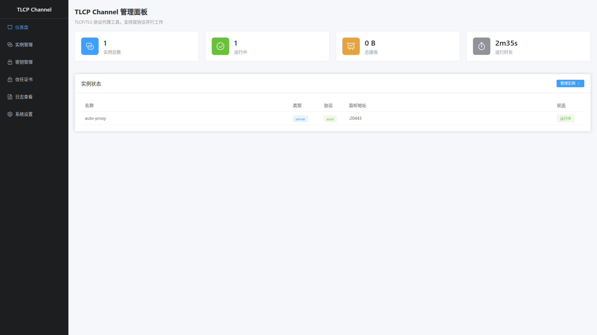

# TLCP Channel

## 介绍

TLCP Channel 传输通道国密改造，无需修改现有应用。一款功能强大的 TLCP/TLS 协议代理工具，支持双协议在同一个端口并行工作，基于国密算法实现安全通信。

## 功能特性

- **双协议支持** - 同时支持 TLCP 1.1 和 TLS 1.0-1.3 协议
- **自动协议检测** - 同一端口自动识别 TLCP/TLS 客户端
- **多种代理模式** - 服务端代理、客户端代理、HTTP 代理
- **国密算法** - 支持 SM2/SM3/SM4 国密密钥库（包含 TLCP 1.1 的 ECC 证书）
- **传输通道身份认证** - 支持单向认证、双向认证
- **Web 管理界面** - Vue3 + Element Plus 现代化管理界面
- **RESTful API** - 完整的 API 接口支持
- **命令行工具** - tlcpchan-cli 命令行管理工具
- **证书热更新** - 无需重启即可更新证书
- **流量统计** - 实时连接数、流量、延迟统计

## 代理模式

| 模式 | 说明 | 典型场景 |
|------|------|----------|
| server | TLCP/TLS → TCP | 后端服务国密改造，将现有 TCP 服务包装为国密服务 |
| client | TCP → TLCP/TLS | 访问国密服务，让普通应用连接国密服务 |
| http-server | HTTPS → HTTP | HTTP 服务国密化，将 Web 服务升级为 HTTPS（支持国密） |
| http-client | HTTP → HTTPS | 客户端国密适配，让 HTTP 客户端访问国密 HTTPS 服务 |

## 常见问题

### Q: TLCP 和 TLS 有什么区别？

TLCP（Transport Layer Cryptography Protocol）是中国国家密码管理局制定的传输层密码协议，基于国密算法（SM2/SM3/SM4）。TLS（Transport Layer Security）是国际标准协议，通常使用 RSA/AES 算法。TLCP Channel 同时支持两种协议，可以满足不同场景需求。

### Q: 支持 Windows 吗？

支持。TLCP Channel 使用 Go 开发，支持 Linux、Windows、macOS 等多平台。

### Q: 如何部署到生产环境？

建议：
1. RPM/DEB/Docker/二进制安装，systemd 服务管理
2. 配置日志轮转
3. 启用访问控制
4. 定期备份密钥库和配置文件

## 技术栈

- **后端**: Go 1.26+, [gotlcp](https://github.com/Trisia/gotlcp)
- **前端**: Vue 3, TypeScript, Element Plus, Vite
- **协议**: TLCP 1.1, TLS 1.0-1.3
- **算法**: SM2/SM3/SM4, RSA/ECDSA/AES
- **配置**: YAML
- **API**: RESTful

## 相关资源

- **文档**: [详细使用文档](docs/)
- **UI 用户手册**: [Web 管理界面使用指南](tlcpchan-ui/docs/README.md)
- **API 文档**: [RESTful API 文档](docs/api.md)
- **示例**: [配置示例](examples/)
- **Demo**: [在线演示](https://demo.tlcpchan.com) (待提供)

## 致谢

- [gotlcp](https://github.com/Trisia/gotlcp) - TLCP 协议 Go 实现
- [gmsm](https://github.com/emmansun/gmsm) - 国密算法库
- [Vue.js](https://vuejs.org/) - 渐进式 JavaScript 框架
- [Element Plus](https://element-plus.org/) - Vue 3 UI 组件库
