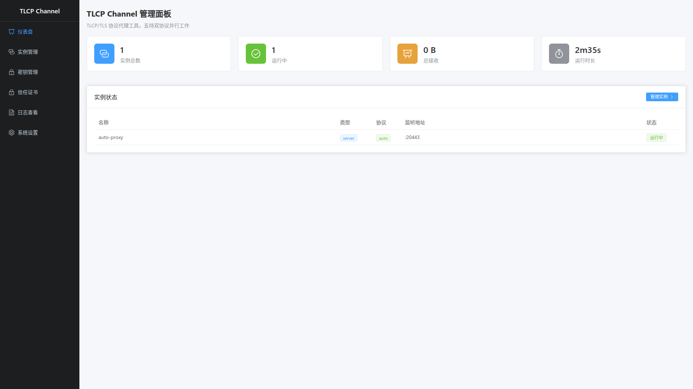

# TLCP Channel

[](https://go.dev/)
[](LICENSE)
[](https://github.com/Trisia/gotlcp)
[](https://goreportcard.com/report/github.com/Trisia/tlcpchan)
[](https://pkg.go.dev/github.com/Trisia/tlcpchan)
[](https://github.com/Trisia/tlcpchan/releases)
[](https://starchart.cc/Trisia/tlcpchan)
[]()
[]()
[]()
[]()
[]()
[]()
[](docs/mcp-usage-guide.md)

## 介绍

TLCP Channel 传输通道国密改造，无需修改现有应用。一款功能强大的 TLCP/TLS 协议代理工具，支持双协议在同一个端口并行工作，基于国密算法实现安全通信。

> ⚠️ **重要提示**：使用本项目前请先阅读 [免责声明](DISCLAIMER.md)




## 功能特性

- **双协议支持** - 同时支持 TLCP 1.1 和 TLS 1.0-1.3 协议
- **自动协议检测** - 同一端口自动识别 TLCP/TLS 客户端
- **多种代理模式** - 服务端代理、客户端代理、HTTP 代理
- **国密算法** - 支持 SM2/SM3/SM4 国密密钥库（包含 TLCP 1.1 的 ECC 证书）
- **传输通道身份认证** - 支持单向认证、双向认证
- **Web 管理界面** - Vue3 + Element Plus 现代化管理界面
- **RESTful API** - 完整的 API 接口支持
- **MCP 协议支持** - 通过 Model Context Protocol 支持 AI 助手集成
- **命令行工具** - tlcpchan-cli 命令行管理工具
- **证书热更新** - 无需重启即可更新证书
- **流量统计** - 实时连接数、流量、延迟统计

## 快速试用

使用 Docker 快速启动 TLCP Channel：

```bash
# 拉取镜像并启动服务
docker run -d \
  --name tlcpchan \
  -p 20080:20080 \
  -p 20443:20443 \
  -v tlcpchan-keystores:/etc/tlcpchan/keystores \
  -v tlcpchan-logs:/etc/tlcpchan/logs \
  tlcpchan/tlcpchan:latest
```

访问服务：

- **Web 管理界面**: http://localhost:20080

从 GitHub Releases 下载最新版本安装包和二进制程序：[https://github.com/Trisia/tlcpchan/releases](https://github.com/Trisia/tlcpchan/releases)

## 代理模式

| 模式 | 说明 | 典型场景 |
|------|------|----------|
| server | TLCP/TLS → TCP | 后端服务国密改造，将现有 TCP 服务包装为国密服务 |
| client | TCP → TLCP/TLS | 访问国密服务，让普通应用连接国密服务 |
| http-server | HTTPS → HTTP | HTTP 服务国密化，将 Web 服务升级为 HTTPS（支持国密） |
| http-client | HTTP → HTTPS | 客户端国密适配，让 HTTP 客户端访问国密 HTTPS 服务 |

## MCP 快速开始

启用 MCP 服务后，可以通过 Model Context Protocol 让 AI 助手管理 TLCP Channel：

```yaml
mcp:
  enabled: true
  api_key: "your-secret-key" # 空表示不需要认证
```

详细使用方法请参考 [MCP 使用指南](docs/mcp-usage-guide.md)。


## 常见问题

### Q: TLCP 和 TLS 有什么区别？

TLCP（Transport Layer Cryptography Protocol）是中国国家密码管理局制定的传输层密码协议，基于国密算法（SM2/SM3/SM4）。TLS（Transport Layer Security）是国际标准协议，通常使用 RSA/AES 算法。TLCP Channel 同时支持两种协议，可以满足不同场景需求。

### Q: 支持 Windows 吗？

支持。TLCP Channel 使用 Go 开发，支持 Linux、Windows、macOS 等多平台。


### Q: 如何部署到生产环境？

建议：
1. RPM/DEB/Docker/二进制安装，systemd 服务管理
2. 配置日志轮转
3. 启用访问控制
4. 定期备份密钥库和配置文件

## 系统适配

| 操作系统 | 支持的架构（CPU厂家） | 支持说明 |
|---------|---------------------|---------|
| **统信UOS** 20 | **飞腾ARM**、**龙芯LoongArch64**、x86_64 (Intel/AMD) | ✓ 国产化环境完整适配 |
| **银河麒麟** V10 | **飞腾ARM**、**龙芯LoongArch64**、x86_64 (Intel/AMD) | ✓ 国产化环境完整适配 |
| Ubuntu 18.04+ | x86_64 (Intel/AMD)、ARM64 (ARM) | ✓ |
| CentOS 7+ | x86_64 (Intel/AMD)、ARM64 (ARM) | ✓ |
| Windows 10+ | x86_64 (Intel/AMD) | ✓ |
| macOS 12 | x86_64 (Intel)、ARM64 (Apple Silicon) | ✓ |

下载最新版本安装包和二进制程序：

- [https://github.com/Trisia/tlcpchan/releases](https://github.com/Trisia/tlcpchan/releases)


## 技术栈

- **后端**: Go 1.26+, [gotlcp](https://github.com/Trisia/gotlcp)
- **前端**: Vue 3, TypeScript, Element Plus, Vite
- **协议**: TLCP 1.1, TLS 1.0-1.3
- **算法**: SM2/SM3/SM4, RSA/ECDSA/AES
- **配置**: YAML
- **API**: RESTful

## 相关资源

- **免责声明**: [免责声明](DISCLAIMER.md)
- **设计文档**: [详细设计文档](docs/design.md)
- **UI 用户手册**: [Web 管理界面使用指南](tlcpchan-ui/README.md)
- **CLI 用户手册**: [CLI 管理使用指南](tlcpchan-cli/README.md)
- **MCP 使用指南**: [Model Context Protocol 使用指南](docs/mcp-usage-guide.md)
- **API 文档**: [RESTful API 文档](docs/api.md)


## 致谢

- [gotlcp](https://github.com/Trisia/gotlcp) - TLCP 协议 Go 实现
- [gmsm](https://github.com/emmansun/gmsm) - 国密算法库
- [Vue.js](https://vuejs.org/) - 渐进式 JavaScript 框架
- [Element Plus](https://element-plus.org/) - Vue 3 UI 组件库
