# TLCP Channel UI 用户手册

## 1. 快速开始

### 1.1 访问 UI

TLCP Channel 提供了直观的 Web 管理界面，您可以通过浏览器访问：

```
http://<服务器地址>:20080/
```

默认端口为 `20080`，如果修改了配置，请使用实际端口访问。

### 1.2 UI界面概览

登录后，您将看到主界面，包含以下主要功能模块：

- **仪表盘** - 系统概览和统计信息
- **实例管理** - 代理实例的创建、配置和管理
- **密钥管理** - 证书密钥库的生成和管理
- **信任证书** - 根证书和信任链管理
- **系统管理** - 系统配置、日志查看、系统设置


*图1：UI 界面总览和系统状态*

仪表盘显示以下信息：
- 系统版本信息
- 运行时间统计
- 实例数量统计（总数、运行中、已停止）
- 快速操作入口

### 1.3 系统初始化

系统首次启动时会自动生成默认的测试证书和配置，帮助您快速了解系统功能。默认创建的内容包括：

- 根 CA 证书（TLCP 和 TLS）
- 默认 keystore（default-tlcp 和 default-tls）
- 测试实例（可选）

---

## 2. 实例管理

### 2.1 实例列表

实例列表页面显示所有配置的代理实例及其状态信息，包括：

- 实例名称
- 实例类型（server/client/http-server/http-client）
- 协议类型（tlcp/tls/auto）
- 监听地址
- 目标地址
- 运行状态（running/stopped）
- 启用状态（enabled/disabled）

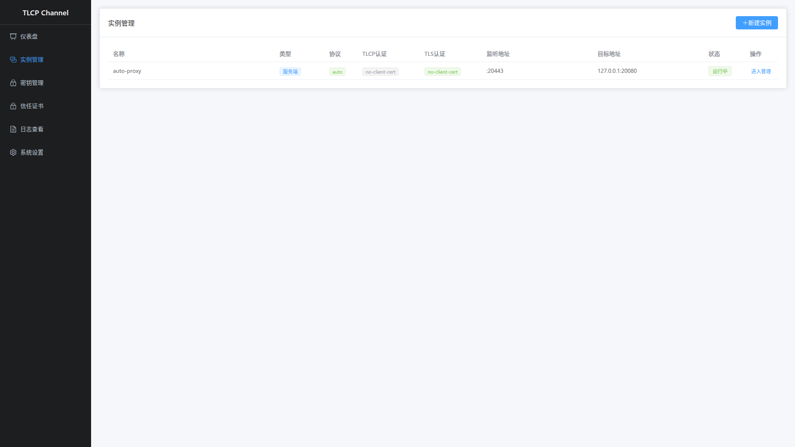

*图5：实例操作列表*

每个实例右侧提供以下操作按钮：
- **启动** - 启动已停止的实例
- **停止** - 停止运行中的实例
- **重启** - 重启实例
- **重载** - 重载实例配置（无需重启）
- **删除** - 删除实例
- **详情** - 查看实例详细信息和配置
- **统计** - 查看实例统计信息
- **日志** - 查看实例日志

### 2.2 创建 TLCP 实例

#### 应用场景

**后端服务国密改造** - 将现有的 TCP 服务升级为支持 TLCP 国密协议的安全服务，无需修改后端服务代码。

#### 配置步骤

**步骤 1：填写基本信息**

点击"新建实例"按钮，在弹出的对话框中填写基本信息：

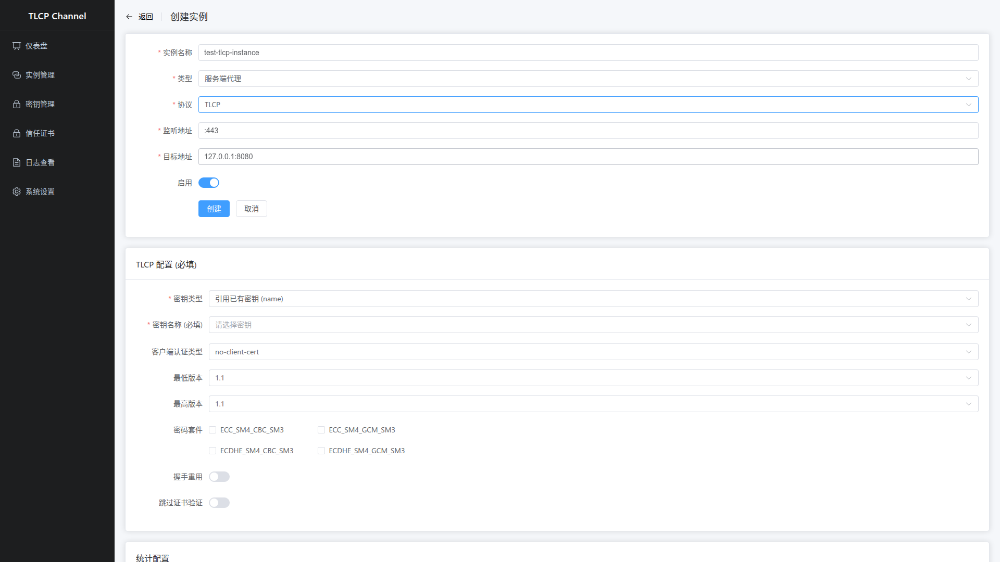

*图2-1：填写 TLCP 实例基本信息*

| 配置项 | 说明 | 示例值 |
|--------|------|--------|
| 实例名称 | 实例的唯一标识，必须唯一 | `my-tlcp-server` |
| 实例类型 | 代理模式 | `server` |
| 监听地址 | 本地监听地址，格式为 `:端口` | `:20443` |
| 目标地址 | 后端服务地址 | `localhost:8080` |
| 协议 | 使用的协议 | `tlcp` |

**步骤 2：选择密钥库**

选择 TLCP 证书密钥库：

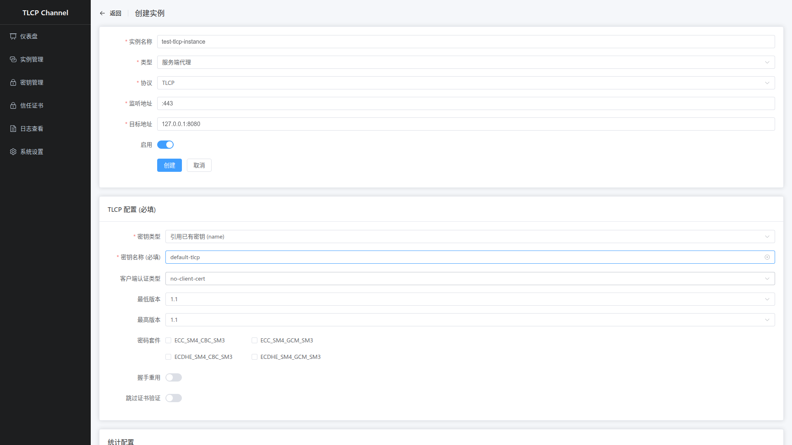

*图2-2：选择 TLCP 密钥库*

TLCP 需要双证书（签名证书和加密证书），可以选择：
- 使用已创建的 keystore（推荐）
- 如果没有 keystore，可以先去"密钥管理"页面创建

**步骤 3：配置协议参数**

配置 TLCP 协议相关参数：


*图2-3：配置 TLCP 协议参数*

| 配置项 | 说明 | 默认值 |
|--------|------|--------|
| 认证模式 | 证书认证方式（none/one-way/mutual） | `one-way` |
| SNI 名称 | 服务端名称标识 | - |
| 客户端 CA | 双向认证时需要，多个用逗号分隔 | - |

**步骤 4：高级配置（可选）**

配置高级参数：


*图2-4：配置高级参数*

| 配置项 | 说明 | 默认值 |
|--------|------|--------|
| 缓冲区大小 | 数据传输缓冲区大小 | 0（自动） |
| 连接超时 | 建立连接超时时间（秒） | 0（无限制） |
| 读取超时 | 读取数据超时时间（秒） | 0（无限制） |
| 写入超时 | 写入数据超时时间（秒） | 0（无限制） |
| 握手超时 | TLS/TLCP 握手超时时间（秒） | 0（无限制） |

**步骤 5：创建并启动**

点击"确定"创建实例，然后在实例列表中点击"启动"按钮启动实例。

### 2.3 创建 TLS 实例

#### 应用场景

**传统 TLS 协议代理** - 为现有的服务提供标准 TLS 协议加密保护，适用于需要兼容传统客户端的场景。

#### 配置步骤

**步骤 1：填写基本信息**

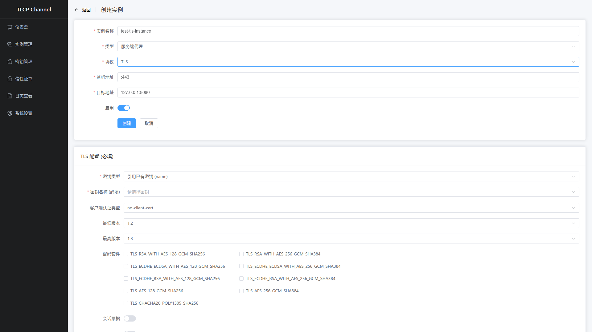

*图3-1：填写 TLS 实例基本信息*

| 配置项 | 说明 | 示例值 |
|--------|------|--------|
| 实例名称 | 实例的唯一标识 | `my-tls-server` |
| 实例类型 | 代理模式 | `server` |
| 监听地址 | 本地监听地址 | `:20443` |
| 目标地址 | 后端服务地址 | `localhost:8080` |
| 协议 | 使用的协议 | `tls` |

**步骤 2：选择密钥库**

TLS 需要单证书（同时用于签名和加密），选择合适的 TLS keystore。

TLS keystore 配置参数与 TLCP 类似，但只需要签名证书。

**步骤 3：配置协议参数和高级配置**

配置方式与 TLCP 实例相同，参考图2-3和图2-4。

### 2.4 创建 AUTO 实例

#### 应用场景

**双协议自动适配** - 同一端口同时支持 TLCP 和 TLS 协议，自动识别客户端使用的协议类型，适用于需要兼容新旧客户端的过渡场景。

#### 配置步骤

**步骤 1：填写基本信息**


*图4-1：填写 AUTO 实例基本信息*

| 配置项 | 说明 | 示例值 |
|--------|------|--------|
| 实例名称 | 实例的唯一标识 | `my-auto-server` |
| 实例类型 | 代理模式 | `server` |
| 监听地址 | 本地监听地址 | `:20443` |
| 目标地址 | 后端服务地址 | `localhost:8080` |
| 协议 | 使用的协议 | `auto` |

**步骤 2：选择 TLCP 密钥库**

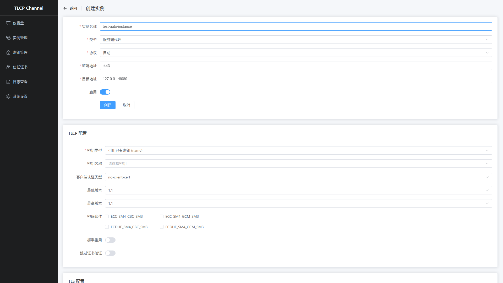

*图4-2：选择 TLCP 密钥库*

选择用于 TLCP 协议的证书密钥库。

**步骤 3：选择 TLS 密钥库**

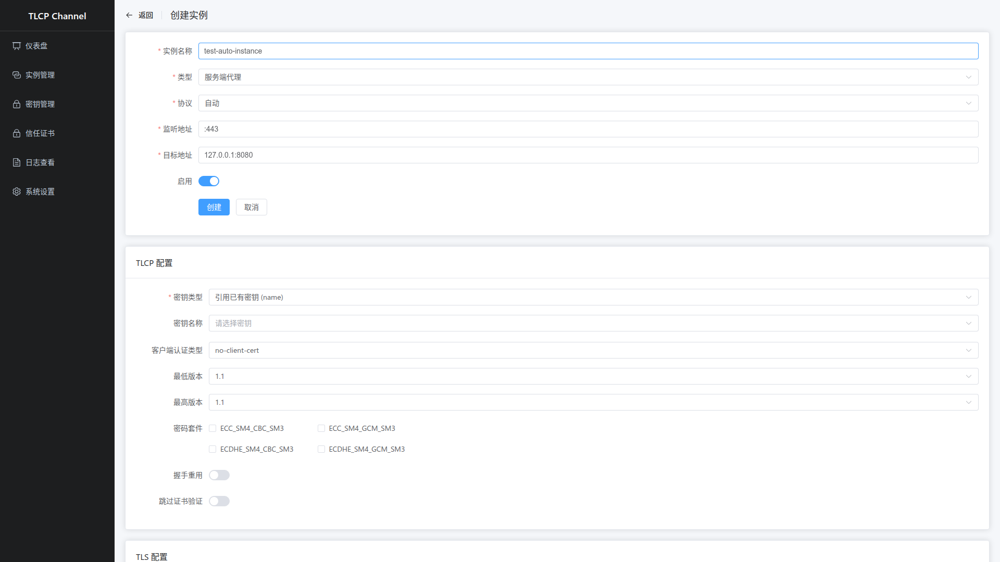

*图4-3：选择 TLS 密钥库*

选择用于 TLS 协议的证书密钥库。

**步骤 4：配置协议参数和高级配置**

配置方式与 TLCP/TLS 实例相同。

### 2.5 查看实例详情

点击实例列表中的"详情"按钮，查看实例的完整配置信息。

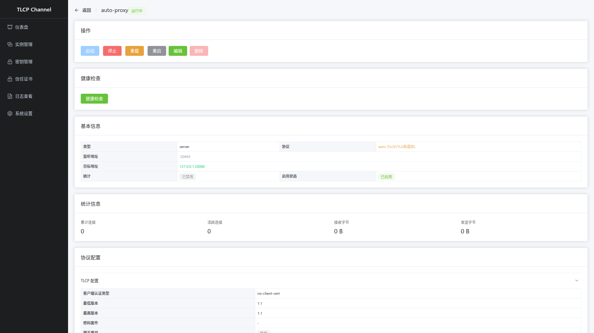

*图6：实例详情和操作按钮*

实例详情页面显示：
- 基本信息（名称、类型、协议、状态等）
- 网络配置（监听地址、目标地址）
- 统计信息（连接数、流量等）
- **TLCP 配置** - 展开 TLCP 协议相关配置
  - 客户端认证类型
  - 协议版本（最低/最高）
  - 密码套件
  - Keystore 类型
  - 签名/加密证书路径
- **TLS 配置** - 展开 TLS 协议相关配置
  - 客户端认证类型
  - 协议版本
  - 密码套件
  - 会话票据、握手重用
  - Keystore 类型
  - 签名证书路径

**操作按钮：**
- **启动** - 启动已停止的实例
- **停止** - 停止运行中的实例
- **重载** - 重载实例配置（无需重启）
- **重启** - 重启实例
- **编辑** - 编辑实例配置
- **删除** - 删除实例（实例运行时无法删除）

**健康检查：**
- 点击"健康检查"按钮，测试实例配置是否正确
- 检查证书是否有效
- 检查端口是否可访问

### 2.6 查看实例统计

点击实例列表中的"统计"按钮，查看实例的实时统计信息，包括：

- 当前连接数
- 总连接数
- 接收字节数
- 发送字节数
- 请求数
- 错误数

### 2.7 查看实例日志

点击实例列表中的"日志"按钮，查看实例的运行日志，支持：
- 按时间筛选
- 按日志级别筛选
- 实时日志流

---

## 3. 证书管理

### 3.1 密钥库列表

密钥库管理页面显示所有已创建的证书密钥库及其详细信息。

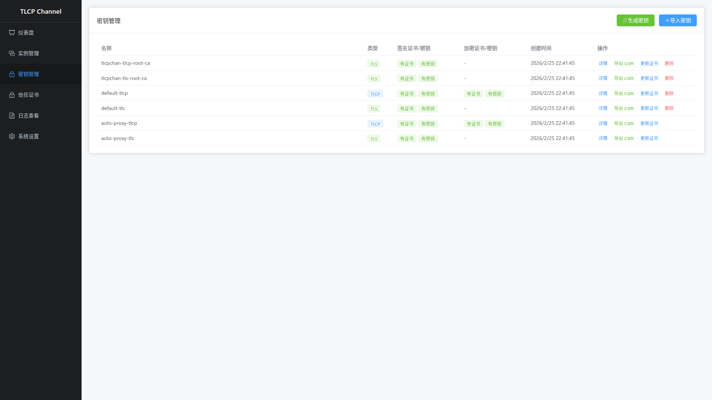

*图7：密钥库列表*

列表显示信息：
- 密钥库名称
- 密钥库类型（tlcp/tls）
- 加载器类型（file/named/skf/sdf）
- 是否受保护
- 创建时间
- 更新时间

### 3.2 生成密钥库

系统支持自动生成国密 SM2 算法的 TLCP 证书和 RSA 算法的 TLS 证书。

#### 操作步骤

**步骤 1：选择生成方式**

点击"生成密钥库"按钮，在弹出的对话框中配置密钥库基本信息。

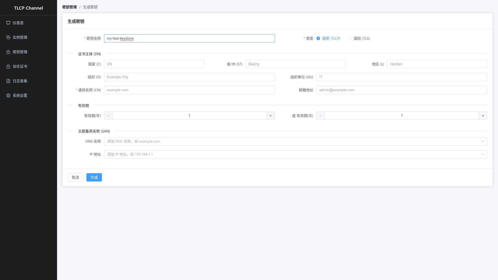

*图8-1：生成密钥库基本配置*

| 配置项 | 说明 | 示例值 |
|--------|------|--------|
| 密钥库名称 | 密钥库的唯一标识 | `my-keystore` |
| 密钥库类型 | 证书类型（tlcp/tls） | `tlcp` |
| 是否受保护 | 是否启用密码保护 | 否 |

**步骤 2：配置证书信息**

填写证书主题信息：


*图8-2：配置证书信息*

| 配置项 | 说明 | 示例值 |
|--------|------|--------|
| 通用名称 (CN) | 证书的通用名称 | `proxy.example.com` |
| 国家 (C) | 两字母国家代码 | `CN` |
| 省/州 (ST) | 省/州名称 | `Beijing` |
| 地区 (L) | 城市/地区名称 | `Beijing` |
| 组织 (O) | 组织名称 | `My Company` |
| 组织单位 (OU) | 组织单位名称 | `IT` |
| 邮箱 | 邮箱地址 | `admin@example.com` |

**步骤 3：配置有效期**

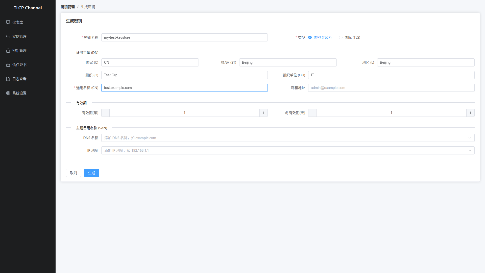

*图8-3：配置有效期和高级选项*

| 配置项 | 说明 | 示例值 |
|--------|------|--------|
| 有效期（年） | 证书有效期，以年为单位 | `5` |
| 有效期（天） | 证书有效期，以天为单位（优先级高于年） | `1825` |
| DNS 名称 | 证书包含的 DNS 名称，多个用逗号分隔 | `proxy.example.com,*.example.com` |
| IP 地址 | 证书包含的 IP 地址，多个用逗号分隔 | `192.168.1.100,10.0.0.1` |

对于 TLS 密钥库，还可以配置：
- 密钥算法（ecdsa/rsa）
- 密钥位数（仅 RSA，默认 2048）

**步骤 4：生成**

点击"确定"生成密钥库和证书。系统会自动生成：
- 签名证书和私钥（TLCP/TLS）
- 加密证书和私钥（仅 TLCP）
- 将证书保存到 `keystores/` 目录

### 3.3 导入密钥库

如果已有现成的证书，可以直接导入使用。

#### 操作步骤

**步骤 1：选择导入类型**

点击"导入密钥库"按钮，选择导入类型（file/named/skf/sdf）。

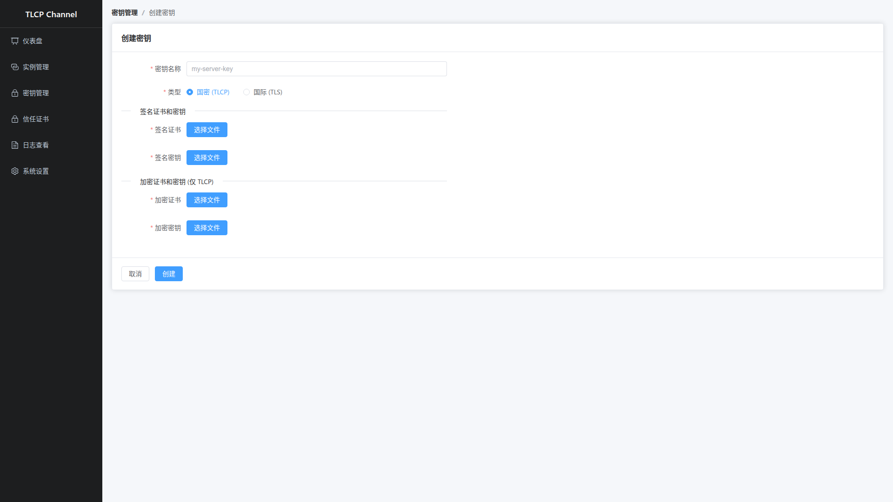

*图9-1：选择导入类型*

**步骤 2：上传证书文件**

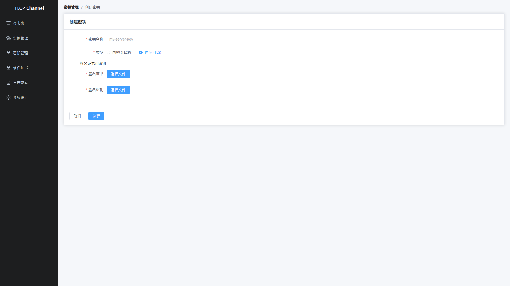

*图9-2：上传证书文件*

对于 TLCP 密钥库，需要上传：
- 签名证书文件（.crt 或 .pem）
- 签名私钥文件（.key）
- 加密证书文件（.crt 或 .pem）
- 加密私钥文件（.key）

对于 TLS 密钥库，需要上传：
- 证书文件（.crt 或 .pem）
- 私钥文件（.key）

**步骤 3：导入**

点击"确定"导入密钥库。系统会验证证书格式和有效性，并将证书保存到 `keystores/` 目录。

### 3.4 查看密钥库详情

点击密钥库列表中的密钥库名称，查看密钥库的详细信息。


*图11：密钥库详情*

**基本信息部分：**
- 密钥库名称
- 证书类型（TLCP/TLS）
- 加载器类型（file/named/skf/sdf）
- 保护状态（是否受密码保护）
- 创建时间和更新时间

**证书密钥参数：**
- 签名证书路径
- 签名密钥路径
- 加密证书路径（仅 TLCP）
- 加密密钥路径（仅 TLCP）
- 修改按钮：可以手动修改证书文件路径

**关联实例：**
- 列出使用此密钥库的实例
- 显示实例名称和状态

**证书信息：**
- 证书主题（Subject）
- 证书颁发者（Issuer）
- 有效期（起始时间、过期时间）
- 证书指纹

### 3.5 导出证书请求 (CSR)

使用现有密钥生成并导出证书请求文件(CSR)，用于向 CA 机构申请签发证书。


*图10：导出 CSR 文件*

#### 操作步骤

1. 点击密钥库的"导出 CSR"按钮
2. 选择密钥类型（sign/enc，enc 仅 TLCP 有效）
3. 填写证书主题信息（CN、O、OU 等）
4. 填写 SAN（DNS 名称、IP 地址）
5. 选择输出文件名或使用自动生成的文件名
6. 点击"确定"导出 CSR 文件

### 3.6 删除密钥库

点击密钥库列表中的"删除"按钮，删除密钥库。

**注意：** 删除密钥库会删除对应的证书文件，请确保没有实例正在使用该密钥库。

### 3.7 重载密钥库

点击密钥库的"重载"按钮，重新加载密钥库证书。在更新证书文件后使用此操作，无需重启服务。

---

## 3.8 根证书管理

根证书管理用于管理受信任的根 CA 证书，用于验证客户端或服务端证书。

### 3.8.1 根证书列表

根证书列表页面显示所有已添加的根证书。

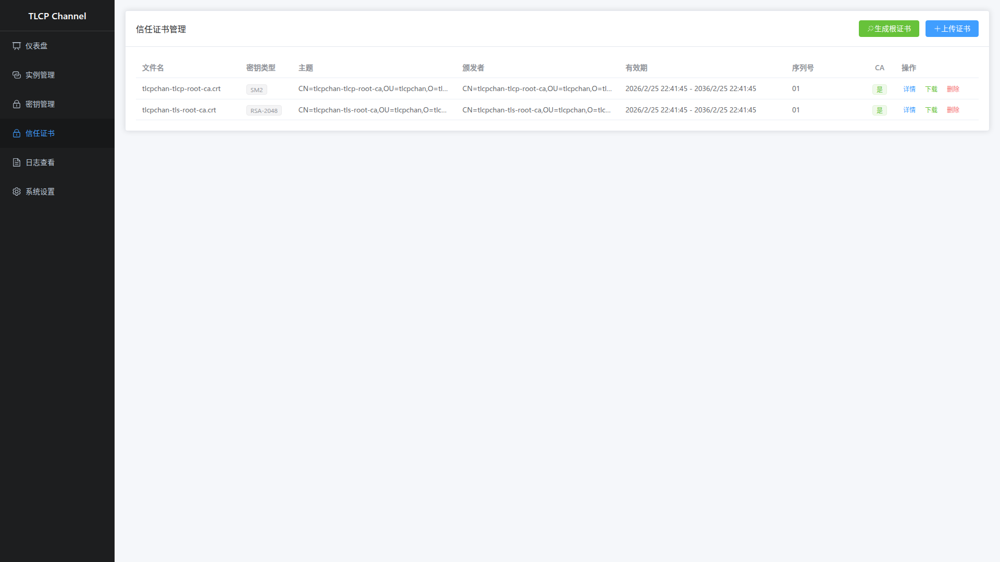

*图12：根证书列表*

列表显示信息：
- 文件名
- 证书主题（Subject）
- 证书颁发者（Issuer）
- 过期时间

### 3.8.2 上传根证书

将外部 CA 的根证书添加到系统信任库中，用于验证客户端或服务端证书。

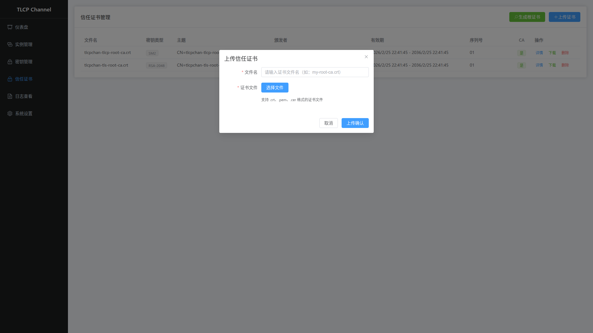

*图13-1：上传根证书*

#### 操作步骤

1. 点击"上传证书"按钮
2. 填写保存文件名（如 `external-ca.crt`）
3. 选择要上传的根证书文件（.crt、.pem 或 .der 格式）
4. 点击"确定"上传

系统会将证书保存到 `rootcerts/` 目录，并自动加载到信任库。

### 3.8.3 生成根 CA 证书

系统支持生成自签名的根 CA 证书。

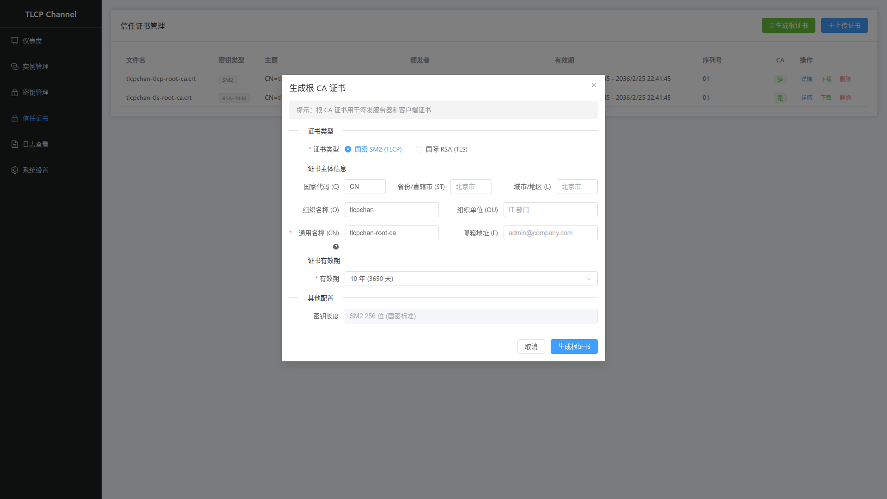

*图13-2：生成根 CA 证书*

#### 操作步骤

1. 点击"生成根 CA"按钮
2. 填写证书主题信息（CN、O、OU 等）
3. 填写有效期（默认 10 年）
4. 点击"确定"生成

系统会生成：
- 根 CA 证书（`tlcpchan-root-ca.crt` 或自定义名称）
- 根 CA 私钥
- 自动添加到信任库

### 3.8.4 查看根证书详情

点击根证书列表中的文件名，查看根证书的详细信息。

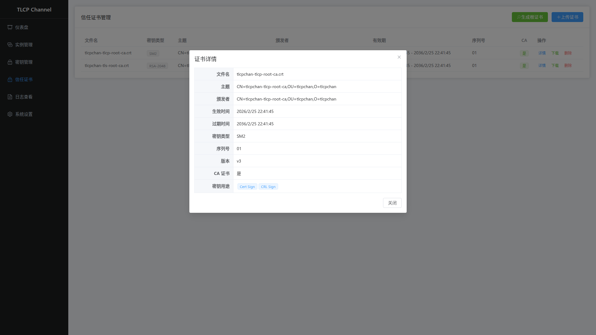

*图14：根证书详情*

详细信息包括：
- 证书主题（Subject）
- 证书颁发者（Issuer）
- 序列号
- 有效期（起始时间、过期时间）
- 公钥信息
- 证书指纹

### 3.8.5 下载根证书

点击根证书的"下载"按钮，下载根证书文件。

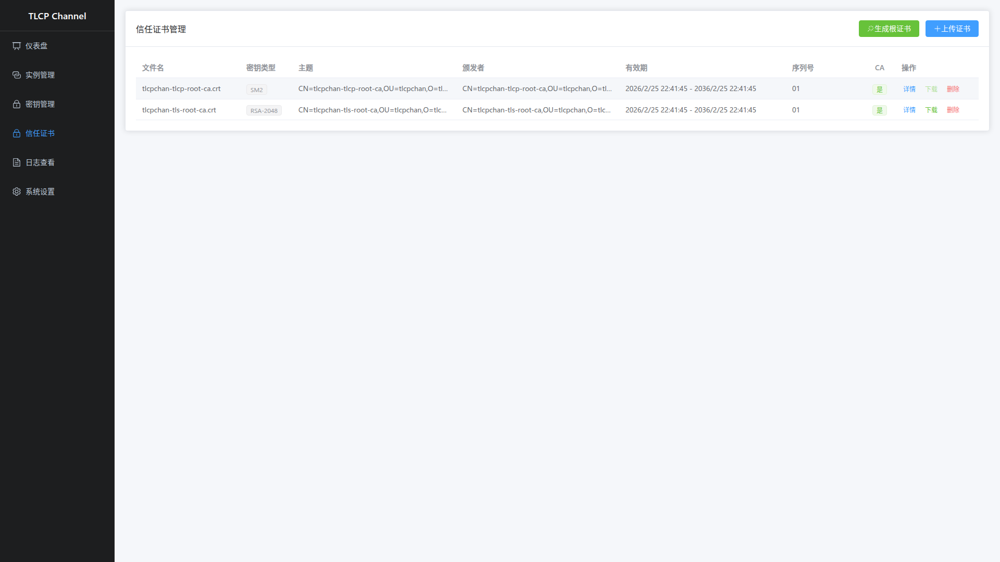

*图15：下载根证书*

### 3.8.6 删除根证书

点击根证书列表中的"删除"按钮，删除根证书。

### 3.8.7 重载根证书

系统会自动重载所有根证书，无需手动操作。在添加或删除根证书后，系统会自动更新信任库。

---

## 4. 系统管理

### 4.1 系统设置

系统设置页面提供了完整的系统配置管理功能。

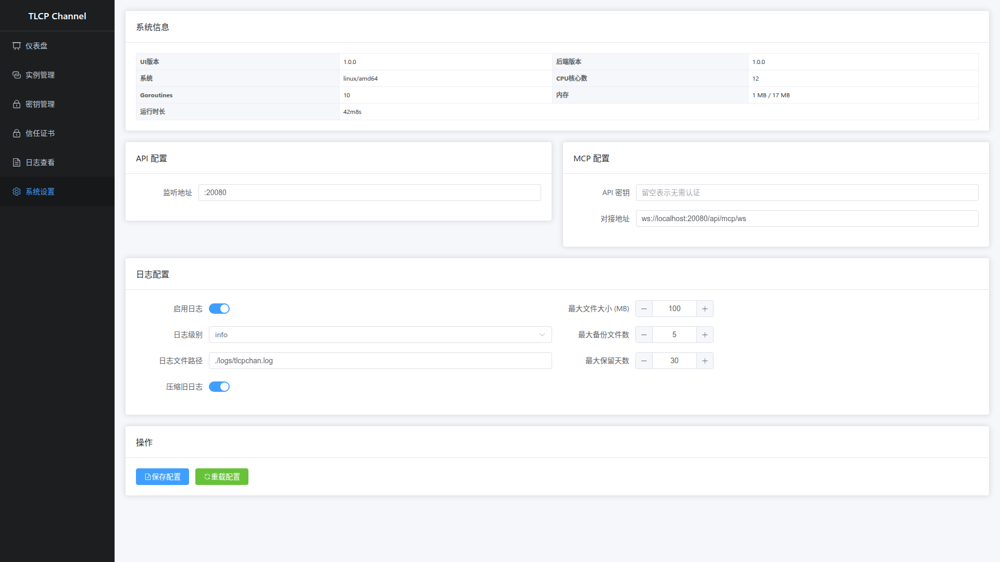

*图16：系统设置页面（含配置查看）*

**系统信息：**
- UI 版本号
- 后端版本号
- 操作系统类型和架构
（显示版本、运行状态）

**API 配置：**
- 监听地址（API 服务端口）
- UI 地址（前端访问地址）

**MCP 配置：**
- API 密钥（留空表示无需认证）
- 对接地址（MCP WebSocket 连接地址）

**日志配置：**
- 启用日志开关
- 日志级别（debug/info/warn/error）
- 日志文件路径
- 最大文件大小（MB）
- 最大备份文件数
- 最大保留天数
- 压缩旧日志开关

**操作：**
- **保存配置** - 保存当前配置到文件
- **重载配置** - 重载配置文件，使更改生效

**说明：** 系统不支持通过 UI 直接修改配置文件。配置更新需要：
1. 编辑服务器上的 `config.yaml` 配置文件
2. 点击"重载配置"按钮或使用 `tlcpchan-cli config reload` 命令重载配置
3. 验证配置已生效（查看系统信息）

### 4.2 日志查看

日志查看器提供系统和实例日志的查看功能。

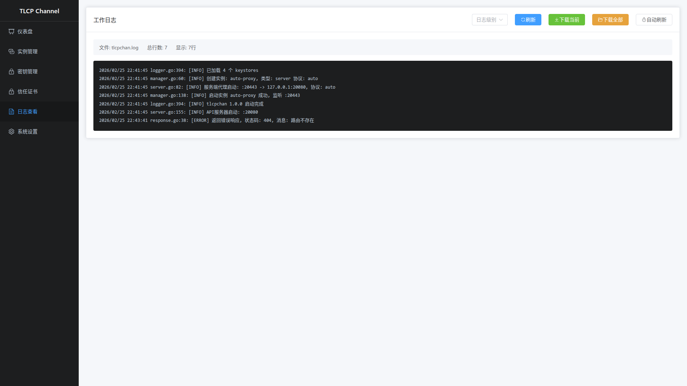

*图17：日志查看器*

**功能说明：**
- **日志文件选择** - 选择要查看的日志文件（tlcpchan.log 等）
- **日志级别筛选** - 选择要显示的日志级别（debug/info/warn/error）
- **刷新** - 手动刷新日志内容
- **自动刷新** - 开启自动滚动，实时查看最新日志
- **下载当前** - 下载当前显示的日志文件
- **下载全部** - 打包下载所有日志文件

**日志显示：**
- 每条日志显示时间戳、日志级别和消息内容
- 不同级别使用不同颜色标识
- 支持滚动查看历史日志

---

## 5. 常见问题

系统信息页面显示系统运行状态和资源使用情况：

- 操作系统信息
- 架构信息
- CPU 核心数
- 内存使用情况
- Goroutine 数量
- 启动时间
2. **02-create-tlcp-instance-01-basic-info.png** - 创建 TLCP 实例：填写基本信息
3. **02-create-tlcp-instance-02-keystore-selection.png** - 创建 TLCP 实例：选择密钥库
4. **02-create-tlcp-instance-03-protocol-config.png** - 创建 TLCP 实例：配置协议参数
5. **02-create-tlcp-instance-04-advanced-config.png** - 创建 TLCP 实例：高级配置
6. **03-create-tls-instance-01-basic-info.png** - 创建 TLS 实例：基本信息
7. **04-create-auto-instance-01-basic-info.png** - 创建 AUTO 实例：基本信息
8. **04-create-auto-instance-02-tlcp-keystore.png** - 创建 AUTO 实例：选择 TLCP 密钥库
9. **04-create-auto-instance-03-tls-keystore.png** - 创建 AUTO 实例：选择 TLS 密钥库
10. **05-instance-operations.png** - 实例列表和操作按钮
11. **06-instance-detail.png** - 实例详情和操作按钮
12. **07-keystore-list.png** - 密钥库列表
13. **08-generate-keystore-01-basic.png** - 生成密钥库：基本配置
14. **08-generate-keystore-02-certificate-info.png** - 生成密钥库：证书信息
15. **08-generate-keystore-03-advanced-options.png** - 生成密钥库：高级选项
16. **09-import-keystore-01-select-type.png** - 导入密钥库：选择类型
17. **09-import-keystore-02-upload-files.png** - 导入密钥库：上传文件
18. **10-export-csr.png** - 导出证书请求 (CSR)
19. **11-keystore-detail.png** - 密钥库详情
20. **12-rootcert-list.png** - 根证书列表
21. **13-manage-rootcert-01-upload.png** - 上传根证书
22. **13-manage-rootcert-02-generate.png** - 生成根 CA 证书
23. **14-manage-rootcert-03-details.png** - 根证书详情
24. **15-manage-rootcert-04-download.png** - 下载根证书
25. **16-system-settings.png** - 系统设置（含配置查看）
26. **17-logs-viewer.png** - 日志查看器

**截图规范：**
- 尺寸：1920x1080 全屏截图
- 内容：显示完整的应用界面
- 标注：使用红色矩形框标注重点区域（通过 Python 脚本 `scripts/annotate_screenshots.py` 自动添加）
- 存储位置：`docs/img/` 目录
