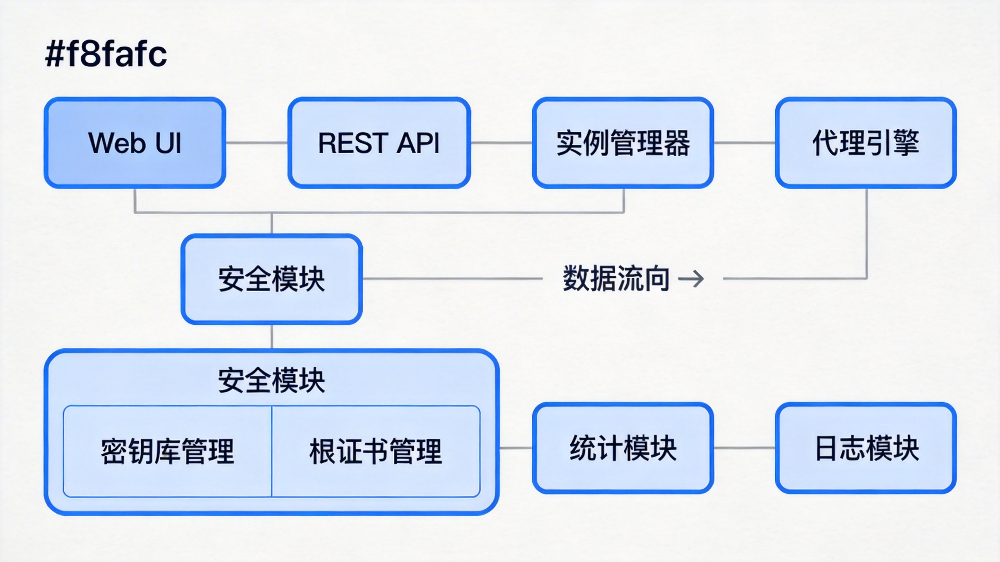
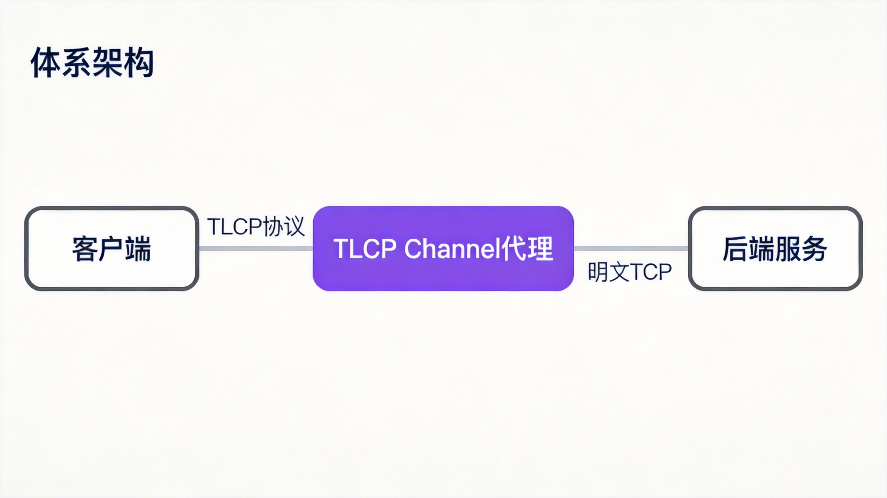
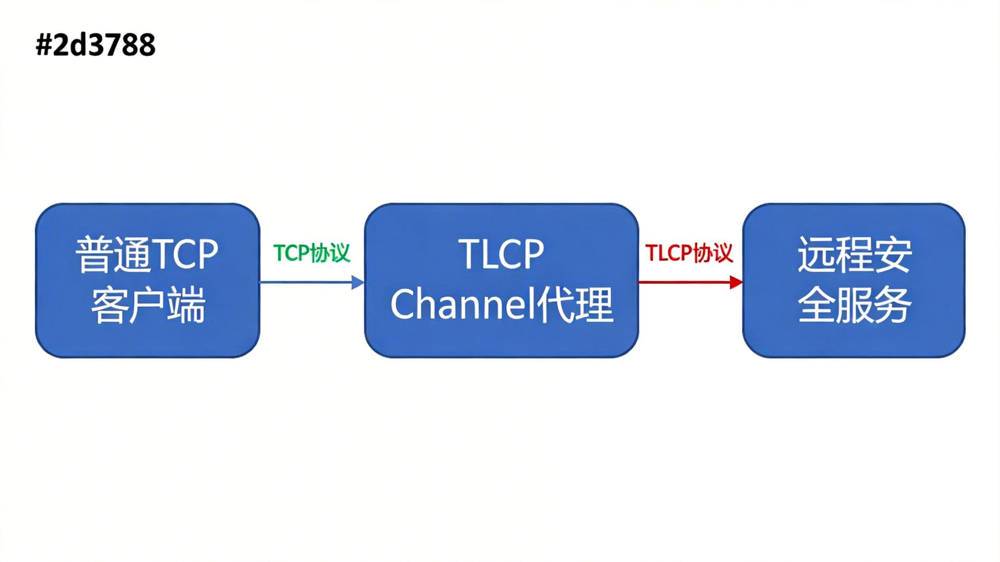
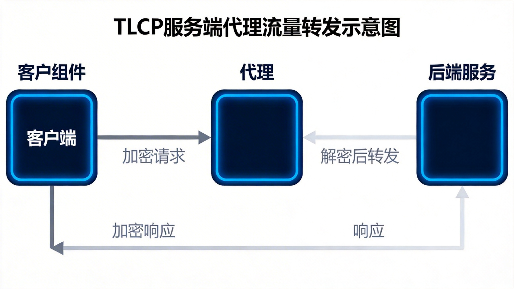

# TLCP Channel UI 用户手册

## 目录

1. [快速开始](#1-快速开始)
2. [实例管理](#2-实例管理)
3. [证书管理](#3-证书管理)
4. [应用场景配置](#4-应用场景配置)
5. [拓扑结构说明](#5-拓扑结构说明)

---

## 1. 快速开始

### 1.1 UI界面概览

TLCP Channel 管理界面包含以下主要功能模块：

- **仪表盘** - 系统概览和统计信息
- **实例管理** - 代理实例的创建、配置和管理
- **密钥管理** - 证书密钥库的生成和管理
- **信任证书** - 根证书和信任链管理
- **日志查看** - 系统和实例日志查看
- **系统设置** - 系统配置管理


### 1.2 默认实例介绍

系统首次启动时会自动创建默认的测试实例，帮助您快速了解系统功能。

---

## 2. 实例管理

### 2.1 创建TLCP实例

#### 应用场景
**后端服务国密改造** - 将现有的TCP服务升级为支持TLCP国密协议的安全服务，无需修改后端服务代码。

#### 配置说明

| 配置项 | 说明 | 示例值 |
|--------|------|--------|
| 实例名称 | 实例的唯一标识 | `my-tlcp-server` |
| 类型 | 代理模式 | `server` |
| 协议 | 使用的协议 | `tlcp` |
| 认证模式 | 证书认证方式 | `one-way` 或 `mutual` |
| 监听地址 | 本地监听地址 | `:20443` |
| 目标地址 | 后端服务地址 | `localhost:8080` |
| 密钥库 | 使用的证书密钥库 | `default-tlcp` |

#### 操作步骤

1. 点击左侧菜单的"实例管理"
2. 点击右上角的"新建实例"按钮
3. 在弹出的对话框中填写配置信息
4. 选择协议为"TLCP"
5. 选择合适的密钥库
6. 点击"确定"创建实例
7. 在实例列表中点击"启动"按钮


### 2.2 创建TLS实例

#### 应用场景
**传统TLS协议代理** - 为现有的服务提供标准TLS协议加密保护，适用于需要兼容传统客户端的场景。

#### 配置说明

| 配置项 | 说明 | 示例值 |
|--------|------|--------|
| 实例名称 | 实例的唯一标识 | `my-tls-server` |
| 类型 | 代理模式 | `server` |
| 协议 | 使用的协议 | `tls` |
| 认证模式 | 证书认证方式 | `one-way` |
| 监听地址 | 本地监听地址 | `:20443` |
| 目标地址 | 后端服务地址 | `localhost:8080` |
| 密钥库 | 使用的证书密钥库 | `default-tls` |

#### 操作步骤

1. 点击左侧菜单的"实例管理"
2. 点击右上角的"新建实例"按钮
3. 在弹出的对话框中填写配置信息
4. 选择协议为"TLS"
5. 选择合适的密钥库
6. 点击"确定"创建实例
7. 在实例列表中点击"启动"按钮


### 2.3 创建AUTO实例

#### 应用场景
**双协议自动适配** - 同一端口同时支持TLCP和TLS协议，自动识别客户端使用的协议类型，适用于需要兼容新旧客户端的过渡场景。

#### 配置说明

| 配置项 | 说明 | 示例值 |
|--------|------|--------|
| 实例名称 | 实例的唯一标识 | `my-auto-server` |
| 类型 | 代理模式 | `server` |
| 协议 | 使用的协议 | `auto` |
| 认证模式 | 证书认证方式 | `one-way` |
| 监听地址 | 本地监听地址 | `:20443` |
| 目标地址 | 后端服务地址 | `localhost:8080` |
| TLCP密钥库 | TLCP协议使用的密钥库 | `default-tlcp` |
| TLS密钥库 | TLS协议使用的密钥库 | `default-tls` |

#### 操作步骤

1. 点击左侧菜单的"实例管理"
2. 点击右上角的"新建实例"按钮
3. 在弹出的对话框中填写配置信息
4. 选择协议为"AUTO"
5. 分别选择TLCP和TLS密钥库
6. 点击"确定"创建实例
7. 在实例列表中点击"启动"按钮


---

## 3. 证书管理

### 3.1 密钥库管理

#### 生成证书密钥对

系统支持自动生成国密SM2算法的TLCP证书和RSA算法的TLS证书。

##### 操作步骤

1. 点击左侧菜单的"密钥管理"
2. 点击右上角的"生成密钥库"按钮
3. 填写密钥库名称
4. 选择密钥库类型（TLCP或TLS）
5. 填写证书主题信息（Common Name、Organization等）
6. 点击"确定"生成


#### 导入现有证书

如果您已有现成的证书，可以直接导入使用。

##### 操作步骤

1. 点击左侧菜单的"密钥管理"
2. 点击右上角的"导入密钥库"按钮
3. 填写密钥库名称
4. 上传证书和私钥文件
5. 点击"确定"导入


### 3.2 根证书管理

#### 上传信任根证书

将外部CA的根证书添加到系统信任库中，用于验证客户端或服务端证书。

##### 操作步骤

1. 点击左侧菜单的"信任证书"
2. 点击右上角的"上传证书"按钮
3. 选择要上传的根证书文件
4. 点击"确定"上传


---

## 4. 应用场景配置

### 4.1 服务端代理配置

**场景描述**：保护后端TCP服务，提供TLCP/TLS加密终结。

**配置要点**：
- 类型：`server`
- 监听地址：对外暴露的加密端口
- 目标地址：后端真实服务地址
- 认证模式：根据安全需求选择

**网络拓扑**：
```
客户端 → TLCP/TLS → TLCP Channel → TCP → 后端服务
          (加密)                      (明文)
```

### 4.2 客户端代理配置

**场景描述**：为普通TCP客户端提供TLCP/TLS加密能力，访问安全服务。

**配置要点**：
- 类型：`client`
- 监听地址：本地监听端口
- 目标地址：远程TLCP/TLS服务地址

**网络拓扑**：
```
客户端 → TCP → TLCP Channel → TLCP/TLS → 远程服务
          (明文)                      (加密)
```

### 4.3 HTTP代理配置

**场景描述**：专门针对HTTP/HTTPS协议的高级代理，支持请求头修改等高级功能。

**配置要点**：
- 类型：`http-server` 或 `http-client`
- 可配置HTTP特定选项

### 4.4 高级配置选项

| 选项 | 说明 |
|------|------|
| 超时设置 | 连接超时、读写超时配置 |
| 缓冲区大小 | 数据传输缓冲区调整 |
| 日志级别 | 实例日志详细程度 |
| 健康检查 | 后端服务健康检查配置 |

---

## 5. 拓扑结构说明

### 5.1 系统架构图

TLCP Channel 系统由多个核心模块组成，各模块协同工作提供完整的代理服务。



系统主要模块说明：
- **Web UI** - 可视化管理界面，提供直观的操作体验
- **REST API** - 提供标准化的RESTful接口供外部调用
- **实例管理器** - 负责代理实例的生命周期管理
- **代理引擎** - 核心流量转发模块，支持TLCP和TLS协议
- **安全模块** - 包含密钥库管理和根证书管理功能
- **统计模块** - 实时统计连接数、流量、延迟等指标
- **日志模块** - 记录系统运行日志和审计信息

### 5.2 典型部署拓扑

#### 服务端代理部署
适用于需要将现有后端服务改造为支持国密TLCP协议的场景。



**网络流向说明**：
1. 客户端发起TLCP协议连接请求
2. TLCP Channel代理终结TLCP连接，进行加密解密
3. 代理将解密后的明文TCP流量转发给后端服务
4. 响应按相反路径返回给客户端

#### 客户端代理部署
适用于需要让普通TCP客户端能够访问TLCP安全服务的场景。



**网络流向说明**：
1. 普通TCP客户端连接到本地TLCP Channel代理
2. 代理建立TLCP加密通道连接到远程安全服务
3. 客户端的明文流量通过加密通道传输
4. 远程服务的响应通过加密通道返回给客户端

#### 高可用部署
对于生产环境，建议采用负载均衡 + 多实例部署方式：
```
                    ┌─────────────────┐
                    │   负载均衡器    │
                    └────────┬────────┘
                             │
            ┌────────────────┼────────────────┐
            │                │                │
    ┌───────▼───────┐ ┌──────▼───────┐ ┌──────▼───────┐
    │ TLCP Channel  │ │ TLCP Channel  │ │ TLCP Channel  │
    │   代理实例1    │ │   代理实例2    │ │   代理实例3    │
    └───────┬───────┘ └───────┬───────┘ └───────┬───────┘
            └────────────────┼────────────────┘
                             │
                    ┌────────▼────────┐
                    │   后端服务群     │
                    └─────────────────┘
```

### 5.3 流量转发示意图

#### TLCP服务端代理详细流量流向

下图展示了完整的TLCP服务端代理的请求-响应流程：



**详细流程说明**：

1. **TLCP握手阶段**
   - 客户端发起TLCP握手请求
   - 代理响应握手，双方协商加密参数和验证证书
   - 建立安全的TLCP加密通道

2. **请求转发阶段**
   - 客户端发送加密的应用数据
   - 代理接收并解密数据
   - 代理解析应用层协议（如HTTP）
   - 代理将明文数据转发给后端服务

3. **响应返回阶段**
   - 后端服务处理请求并返回响应
   - 代理接收后端响应
   - 代理对响应进行TLCP加密
   - 加密后的响应返回给客户端

4. **连接管理**
   - 支持连接复用和Keep-Alive
   - 自动处理异常断线和重连
   - 连接池管理提升性能

---

## 附录

### 常见问题

**Q: 如何选择合适的协议类型？**
A:
- 新系统或国密要求场景：选择 TLCP
- 兼容传统客户端：选择 TLS
- 过渡期或混合环境：选择 AUTO

**Q: 认证模式应该如何选择？**
A:
- 测试环境：none（不验证）
- 常规生产：one-way（验证服务端）
- 高安全要求：mutual（双向验证）

**Q: 如何更换证书而不中断服务？**
A: 使用证书热更新功能，上传新证书后点击"重载"按钮即可。

### 相关资源

- [项目GitHub仓库](https://github.com/Trisia/tlcpchan)
- [API接口文档](../docs/api.md)
- [命令行工具使用指南](../tlcpchan-cli/README.md)
