# TLCP Channel UI 用户手册

## 1. 快速开始

### 1.1 访问 UI

TLCP Channel 提供了直观的 Web 管理界面，您可以通过浏览器访问：

```
http://<服务器地址>:20080/
```

默认端口为 `20080`，如果修改了配置，请使用实际端口访问。

### 1.2 UI界面概览

登录后，您将看到主界面，包含以下主要功能模块：

- **仪表盘** - 系统概览和统计信息
- **实例管理** - 代理实例的创建、配置和管理
- **密钥管理** - 证书密钥库与 IBC（SM9）身份的生成和管理
- **信任证书** - 根证书和信任链管理
- **IBC 信任池** - KGC（密钥生成中心）公共参数管理，用于校验对端 IBC 身份
- **日志查看** - 服务运行日志的查看、筛选与下载
- **系统设置** - 系统信息、API/MCP 配置与日志配置

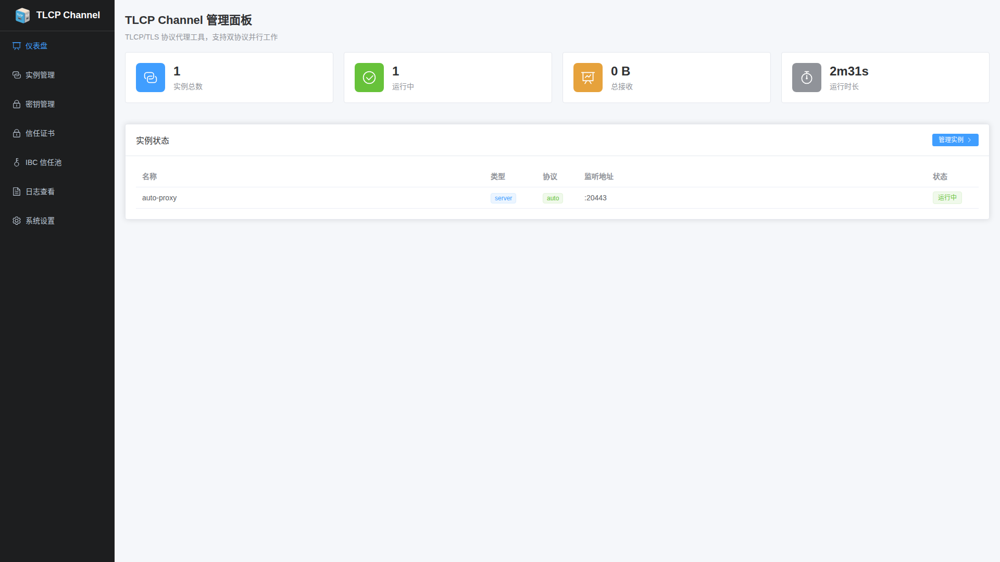

*图1：UI 界面总览和系统状态*

仪表盘显示以下信息：
- 实例总数与运行中实例数量
- 总接收流量与运行时长
- 实例状态列表（名称、类型、协议、监听地址、状态）
- 快速操作入口（管理实例）

### 1.3 系统初始化

系统首次启动时会自动生成默认的测试证书和配置，帮助您快速了解系统功能。默认创建的内容包括：

- 根 CA 证书（TLCP 和 TLS）
- 默认 keystore（default-tlcp 和 default-tls）
- 内置测试 KGC 公共参数（`ibcparams/tlcpchan-ibc-kgc.pem`）与两个 IBC 身份（`default-ibc-server`、`default-ibc-client`）
- 测试实例（可选）

---

## 2. 实例管理

### 2.1 实例列表

实例列表页面显示所有配置的代理实例及其状态信息，包括：

- 实例名称
- 实例类型（服务端代理/客户端代理/HTTP 服务/HTTP 客户端）
- 协议类型（自动/TLCP/TLS）
- 监听地址
- 目标地址
- 运行状态（运行中/已停止）
- 操作（进入管理）

> 认证类型、IBC 身份与 IBC 套件不再在实例列表展示，请在实例详情页查看。

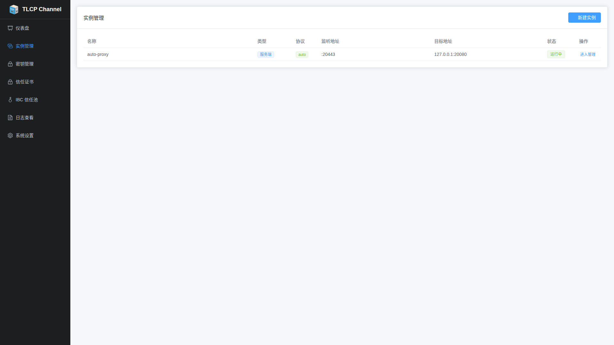

*图5：实例操作列表*

列表右侧只保留 **进入管理** 一个入口，点击后进入实例详情页；启动、停止、重载、重启、编辑、删除与健康检查等操作都在详情页的「操作」卡片中完成（详见 2.5 节）。

### 2.2 创建 TLCP 实例

#### 应用场景

**后端服务国密改造** - 将现有的 TCP 服务升级为支持 TLCP 国密协议的安全服务，无需修改后端服务代码。

#### 配置步骤

**步骤 1：填写基本信息**

点击"新建实例"按钮，进入创建实例页面，先填写基本信息（页面顶部为「创建」「取消」按钮）：

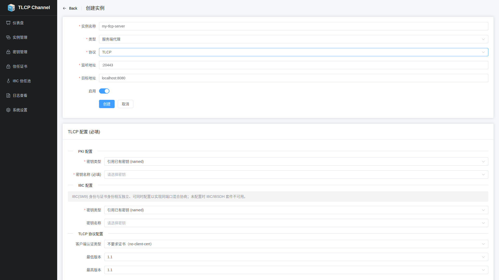

*图2-1：填写 TLCP 实例基本信息*

| 配置项 | 说明 | 示例值 |
|--------|------|--------|
| 实例名称 | 实例的唯一标识，必须唯一 | `my-tlcp-server` |
| 实例类型 | 代理模式：服务端代理/客户端代理/HTTP 服务/HTTP 客户端 | `服务端代理` |
| 协议 | 使用的协议：自动/TLCP/TLS | `TLCP` |
| 监听地址 | 本地监听地址，格式为 `:端口` | `:20443` |
| 目标地址 | 后端服务地址 | `localhost:8080` |
| 启用 | 是否在创建后直接启用该实例 | 勾选 |

**步骤 2：配置 PKI 与 IBC 身份**

在「PKI 配置」块选择 TLCP 证书密钥库：

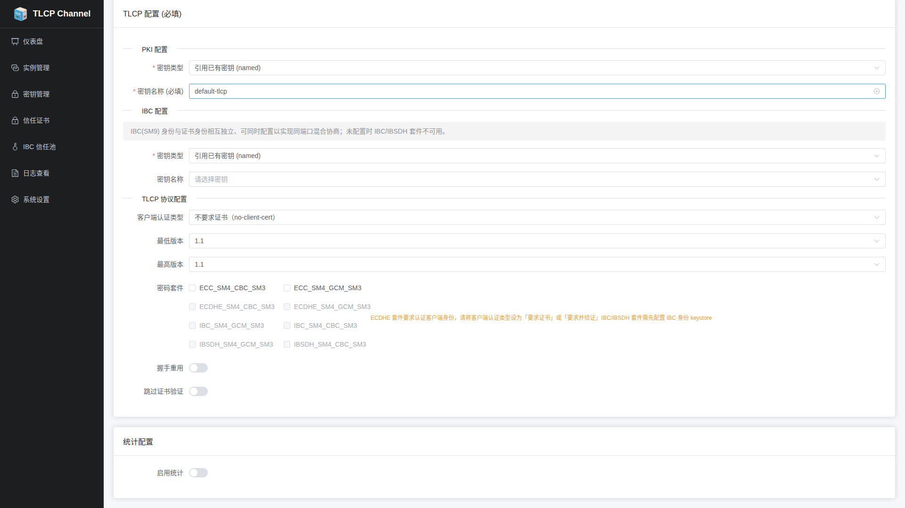

*图2-2：选择 TLCP 密钥库*

TLCP 需要双证书（签名证书和加密证书），可以选择：
- 使用已创建的 keystore（推荐）
- 如果没有 keystore，可以先去"密钥管理"页面创建

> **IBC（SM9）身份（可选）**：需要在同一实例上使用 IBC/IBSDH 套件时，在「IBC 配置」块选择 **IBC 身份密钥库**（`ibc` 类型）即可。未选择 IBC 身份时，密码套件中的 `IBC_SM4_*` / `IBSDH_SM4_*` 选项会置灰并提示"需先配置 IBC 身份密钥库"。证书身份与 IBC 身份可只配其一，也可同时配置以实现混合协商。

**步骤 3：配置 TLCP 协议参数**

在「TLCP 协议配置」块配置协议相关参数：

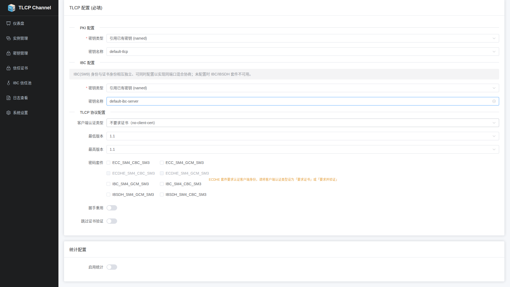

*图2-3：配置 TLCP 协议参数*

| 配置项 | 说明 | 默认值 |
|--------|------|--------|
| 客户端认证类型 | 是否要求对端（客户端）出示证书 | `不要求证书（no-client-cert）` |
| 最低版本 / 最高版本 | 允许的 TLCP 协议版本范围 | 空（使用后端默认版本） |
| 密码套件 | 勾选参与协商的 TLCP 套件，受下方依赖规则限制 | 空（使用后端默认证书套件） |
| 握手重用 | 是否允许会话复用 | 关闭 |
| 跳过证书验证 | 是否跳过对端证书链校验（仅供测试环境使用） | 关闭 |

> **ECDHE 套件依赖（`ECDHE_SM4_*`）**：ECDHE 套件必须认证客户端身份，因此有两个前置条件——① 已配置完整的 TLCP 证书 keystore；② **服务端类型**（server / http-server）的客户端认证类型为「要求证书（require-any-client-cert）」或「要求并验证（require-and-verify-client-cert）」。任一条件不满足时 ECDHE 选项置灰并给出提示；条件失效时已勾选的 ECDHE 会被自动移除，改为合格值后恢复可选。客户端类型（client / http-client）的 ECDHE 只要求配置了客户端密钥（TLCP 证书 keystore）即可选中，其单向认证下未配 keystore 时同样置灰。

**步骤 4：勾选密码套件与统计配置（可选）**

在「TLCP 协议配置」块继续向下，可勾选参与协商的密码套件；页面底部的「统计配置」用于决定是否启用统计：

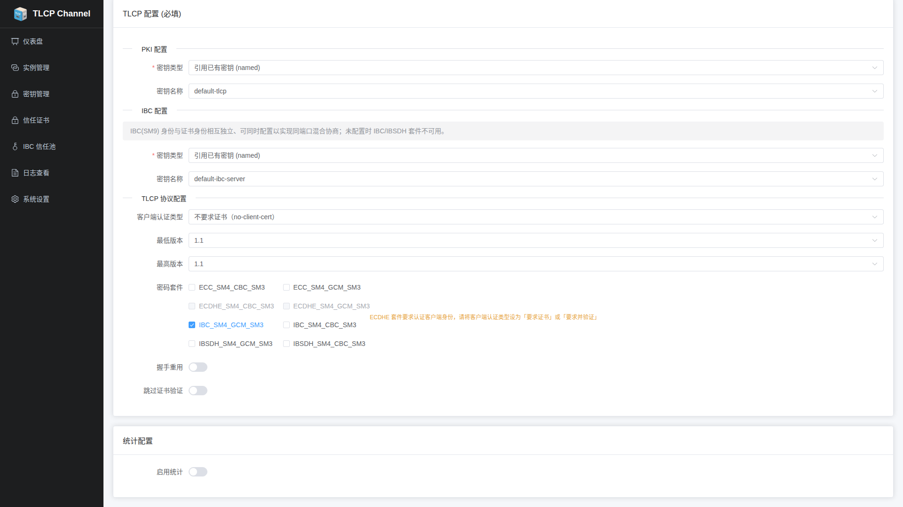

*图2-4：勾选密码套件与统计配置*

| 配置项 | 说明 | 默认值 |
|--------|------|--------|
| 密码套件 | 勾选参与协商的 TLCP 套件；`IBC_SM4_*` / `IBSDH_SM4_*` 需要先配置 IBC 身份 | 空 |
| 启用统计 | 是否统计该实例的连接数、流量等指标 | 关闭 |

**步骤 5：创建并启动**

点击"创建"按钮创建实例；若未勾选「启用」，再到实例详情页的「操作」卡片点击"启动"。

### 2.3 创建 TLS 实例

#### 应用场景

**传统 TLS 协议代理** - 为现有的服务提供标准 TLS 协议加密保护，适用于需要兼容传统客户端的场景。

#### 配置步骤

**步骤 1：填写基本信息**

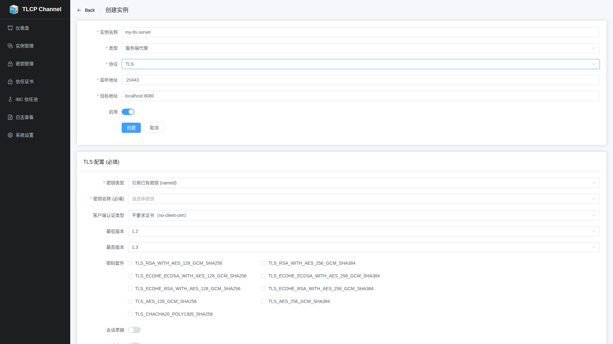

*图3-1：填写 TLS 实例基本信息*

| 配置项 | 说明 | 示例值 |
|--------|------|--------|
| 实例名称 | 实例的唯一标识 | `my-tls-server` |
| 实例类型 | 代理模式 | `服务端代理` |
| 协议 | 使用的协议 | `TLS` |
| 监听地址 | 本地监听地址 | `:20443` |
| 目标地址 | 后端服务地址 | `localhost:8080` |

**步骤 2：配置 PKI 身份**

在「TLS 配置」的「PKI 配置」块选择 TLS 密钥库（单证书，同时用于签名和加密）。协议选择 TLS 时，页面不会出现「TLCP 配置」卡片，也没有 IBC 配置块。

**步骤 3：配置 TLS 协议参数**

在「TLS 协议配置」块配置客户端认证类型、协议版本（最低/最高）、密码套件、会话票据与握手重用等参数，配置方式与 TLCP 实例类似。

### 2.4 创建 AUTO 实例

#### 应用场景

**双协议自动适配** - 同一端口同时支持 TLCP 和 TLS 协议，自动识别客户端使用的协议类型，适用于需要兼容新旧客户端的过渡场景。

#### 配置步骤

**步骤 1：填写基本信息**

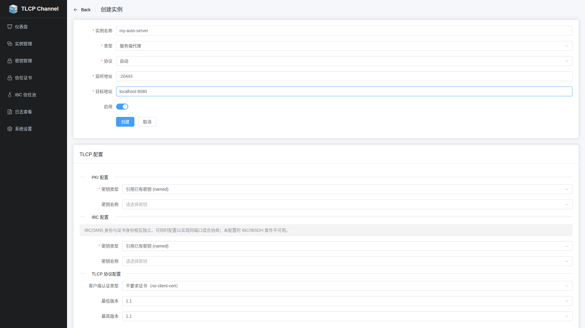

*图4-1：填写 AUTO 实例基本信息*

| 配置项 | 说明 | 示例值 |
|--------|------|--------|
| 实例名称 | 实例的唯一标识 | `my-auto-server` |
| 实例类型 | 代理模式 | `服务端代理` |
| 协议 | 使用的协议 | `自动` |
| 监听地址 | 本地监听地址 | `:20443` |
| 目标地址 | 后端服务地址 | `localhost:8080` |

**步骤 2：配置 TLCP 侧的 PKI 身份**

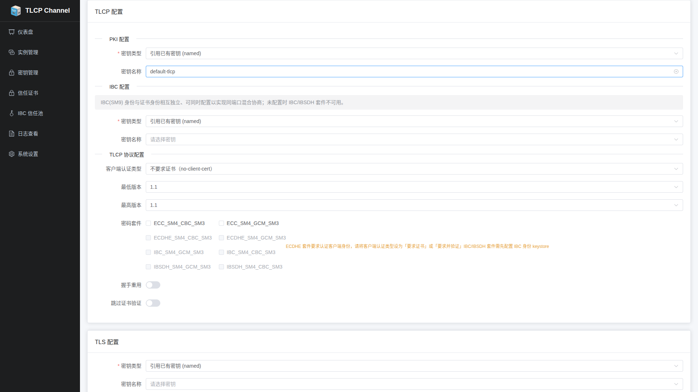

*图4-2：选择 TLCP 密钥库*

在「TLCP 配置」的「PKI 配置」块选择用于 TLCP 协议的证书密钥库。

**步骤 3：配置 TLS 侧的 PKI 身份**

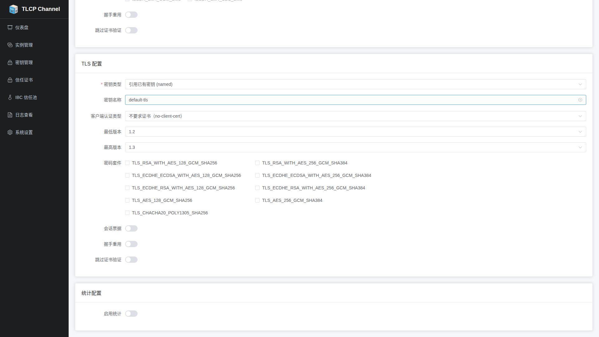

*图4-3：选择 TLS 密钥库*

在「TLS 配置」的「PKI 配置」块选择用于 TLS 协议的证书密钥库。

**步骤 4：配置协议参数**

AUTO 协议下页面会同时出现「TLCP 配置」与「TLS 配置」两张卡片：前者含 PKI 配置、IBC 配置与 TLCP 协议配置，后者含 PKI 配置与 TLS 协议配置，可分别配置两套协议参数。

### 2.5 查看实例详情

在实例列表中点击"进入管理"，查看实例的完整配置信息。

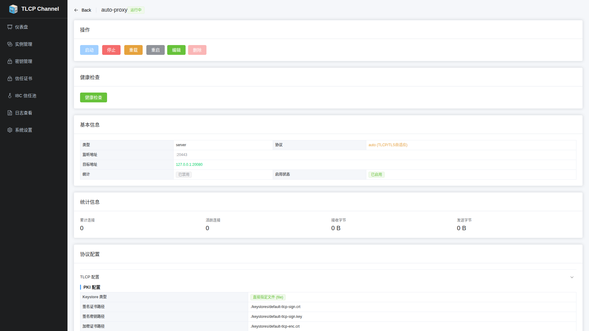

*图6：实例详情和操作按钮*

实例详情页面显示：
- 基本信息（名称、类型、协议、状态等）
- 网络配置（监听地址、目标地址）
- 统计信息（连接数、流量等）
- **TLCP 配置** - 展开 TLCP 协议相关配置，按三块分组展示：
  - **PKI 配置**：证书 keystore 类型、引用名称、签名/加密证书与密钥路径（未配置时显示“未配置”）
  - **IBC 配置**：IBC 身份 keystore（类型、引用名称或材料文件路径）、IBC 身份元信息（引用密钥库时展示标识、KGC 区域/序号、公共参数状态与有效期、三把用户私钥状态；直接指定材料时提示以文件内容为准）
  - **TLCP 协议配置**：客户端认证类型、协议版本（最低/最高）、密码套件、IBC/IBSDH 套件（单独列出，便于确认是否启用标识密码）、握手重用、跳过证书验证
- **TLS 配置** - 展开 TLS 协议相关配置，按 **PKI 配置** / **TLS 协议配置** 两块分组展示
  - PKI 配置：Keystore 类型、签名证书路径
  - TLS 协议配置：客户端认证类型、协议版本、密码套件、会话票据、握手重用

**操作按钮：**
- **启动** - 启动已停止的实例
- **停止** - 停止运行中的实例
- **重载** - 重载实例配置（无需重启）
- **重启** - 重启实例
- **编辑** - 编辑实例配置
- **删除** - 删除实例（实例运行时无法删除）

**健康检查：**
- 点击"健康检查"按钮，测试实例配置是否正确
- 检查证书是否有效
- 检查端口是否可访问

### 2.6 查看实例统计

实例详情页的「统计信息」卡片展示该实例的实时指标（需要在创建或编辑时勾选「启用统计」）：

- 累计连接 / 活跃连接
- 接收字节 / 发送字节

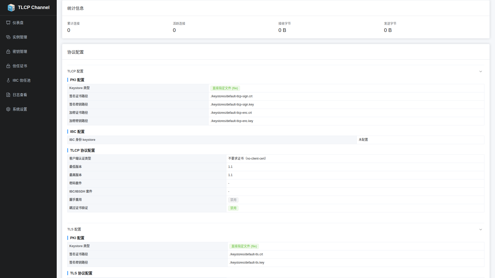

*图6-1：实例详情页的统计信息*

### 2.7 查看运行日志

实例的运行日志统一写入服务工作日志，请到左侧菜单的「日志查看」页面查看，支持按日志级别筛选、自动刷新与下载（详见 4.2 节）。实例列表不提供单独的"日志"入口。

---

## 3. 证书管理

### 3.1 密钥库列表

密钥库管理页面按分类 Tab 展示所有已创建的密钥，分类会同步到地址栏（`?tab=pki` / `?tab=ibc`），刷新后仍停留在原分类。PKI Tab 提供"生成密钥""导入密钥"两个按钮，IBC Tab 对应提供"生成 IBC 身份""导入 IBC 身份"。

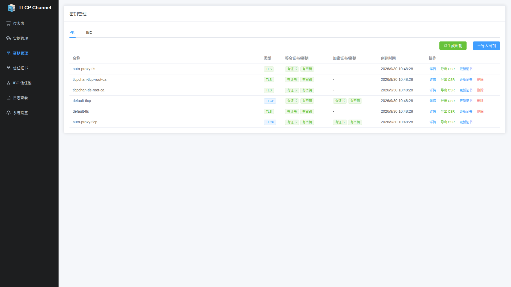

*图7：密钥库列表（PKI 分类）*

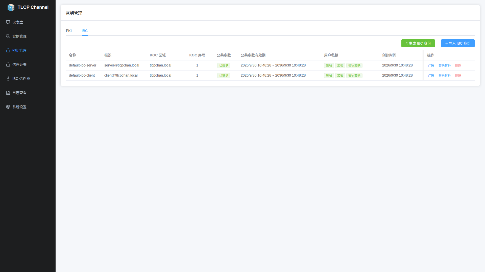

*图7-2：密钥库列表（IBC 分类）*

**PKI Tab**（证书类密钥：TLCP 的 SM2 双证书、TLS 的 RSA/ECC 证书）：

- 名称
- 类型（tlcp/tls）
- 签名证书/密钥状态
- 加密证书/密钥状态（列表中存在 TLCP 密钥时展示）
- 创建时间
- 操作：详情、导出 CSR、更新证书、删除

**IBC Tab**（IBC(SM9) 标识身份密钥，不使用 X.509 证书）：

- 名称
- 标识（如 `server@tlcpchan.local`）
- KGC 区域与序号
- KGC 公共参数状态与有效期
- 三把用户私钥状态（hid=0x01 签名 / hid=0x03 加密 / hid=0x02 密钥交换）
- 创建时间
- 操作：详情、替换材料、删除

### 3.2 生成密钥库

系统支持自动生成国密 SM2 算法的 TLCP 证书和 RSA 算法的 TLS 证书。

#### 操作步骤

**步骤 1：选择生成方式**

在密钥管理页点击"生成密钥"，进入生成密钥页面，先填写密钥名称并选择类型：

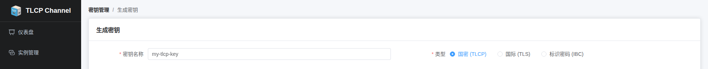

*图8-1：生成密钥库基本配置*

| 配置项 | 说明 | 示例值 |
|--------|------|--------|
| 密钥名称 | 密钥库的唯一标识 | `my-tlcp-key` |
| 类型 | 国密 (TLCP) / 国际 (TLS) / 标识密码 (IBC) | `国密 (TLCP)` |

**步骤 2：配置证书信息**

填写证书主题信息：

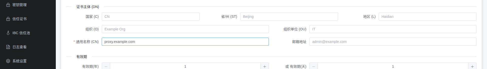

*图8-2：配置证书信息*

| 配置项 | 说明 | 示例值 |
|--------|------|--------|
| 通用名称 (CN) | 证书的通用名称 | `proxy.example.com` |
| 国家 (C) | 两字母国家代码 | `CN` |
| 省/州 (ST) | 省/州名称 | `Beijing` |
| 地区 (L) | 城市/地区名称 | `Beijing` |
| 组织 (O) | 组织名称 | `My Company` |
| 组织单位 (OU) | 组织单位名称 | `IT` |
| 邮箱 | 邮箱地址 | `admin@example.com` |

**步骤 3：配置有效期**

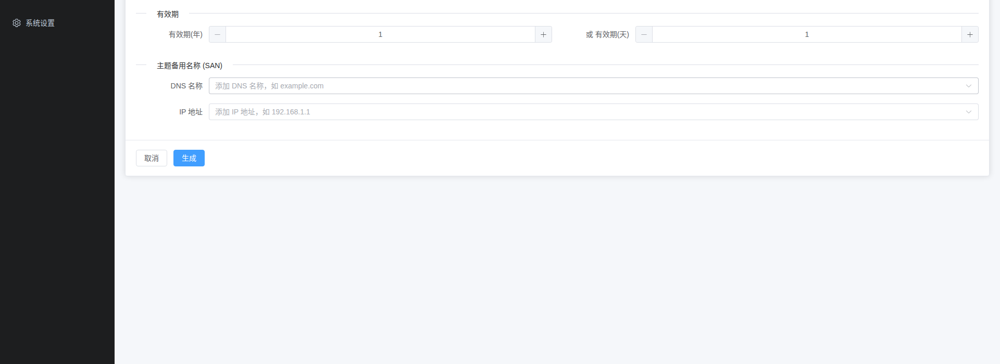

*图8-3：配置有效期和高级选项*

| 配置项 | 说明 | 示例值 |
|--------|------|--------|
| 有效期（年） | 证书有效期，以年为单位 | `5` |
| 有效期（天） | 证书有效期，以天为单位（优先级高于年） | `1825` |
| DNS 名称 | 证书包含的 DNS 名称，多个用逗号分隔 | `proxy.example.com,*.example.com` |
| IP 地址 | 证书包含的 IP 地址，多个用逗号分隔 | `192.168.1.100,10.0.0.1` |

对于 TLS 密钥库，还可以配置：
- 密钥算法（ecdsa/rsa）
- 密钥位数（仅 RSA，默认 2048）

**步骤 4：生成**

点击"生成"按钮生成密钥库和证书。系统会自动生成：
- 签名证书和私钥（TLCP/TLS）
- 加密证书和私钥（仅 TLCP）
- 将证书保存到 `keystores/` 目录

### 3.3 导入密钥库

如果已有现成的证书，可以直接导入使用。

#### 操作步骤

**步骤 1：选择导入类型**

点击"导入密钥"按钮，进入创建密钥页面，填写密钥名称并选择类型（国密 (TLCP) / 国际 (TLS) / 标识密码 (IBC)）。

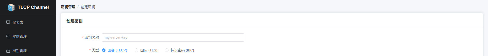

*图9-1：选择导入类型*

**步骤 2：上传证书文件**

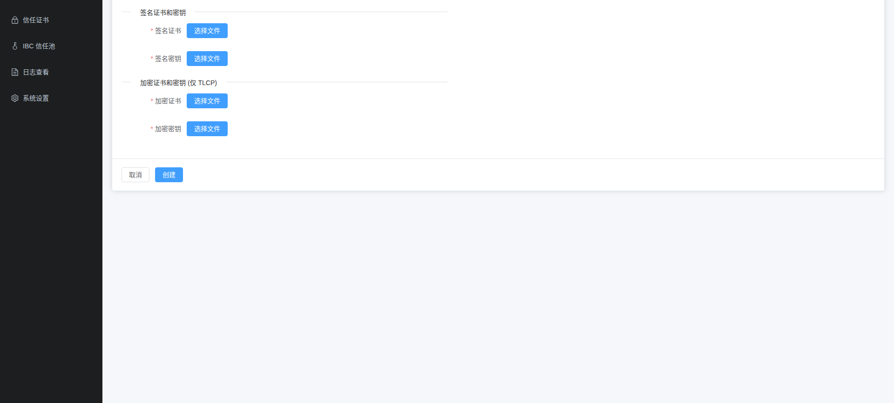

*图9-2：上传证书文件*

对于 TLCP 密钥库，需要上传（分为「签名证书和密钥」「加密证书和密钥 (仅 TLCP)」两块）：
- 签名证书文件（.crt 或 .pem）
- 签名私钥文件（.key）
- 加密证书文件（.crt 或 .pem）
- 加密私钥文件（.key）

对于 TLS 密钥库，只需要签名证书与签名密钥。

对于 IBC 身份（类型选择"标识密码 (IBC)"），需要上传「IBC 身份材料 (SM9，不使用 X.509 证书)」：
- 标识文件
- KGC 公共参数（可选）
- 签名私钥（hid=0x01）、加密私钥（hid=0x03）、密钥交换私钥（hid=0x02）

**步骤 3：导入**

点击"创建"按钮导入密钥库。系统会验证证书格式和有效性，并将证书保存到 `keystores/` 目录。

### 3.4 查看密钥库详情

在密钥库列表中点击操作列的"详情"，查看密钥库的详细信息。

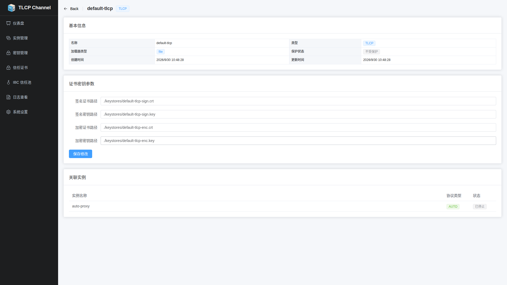

*图11：PKI 密钥库详情*

**基本信息部分：**
- 密钥库名称
- 证书类型（TLCP/TLS）
- 加载器类型（file/named/skf/sdf）
- 保护状态（是否受密码保护）
- 创建时间和更新时间

**证书密钥参数：**
- 签名证书路径
- 签名密钥路径
- 加密证书路径（仅 TLCP）
- 加密密钥路径（仅 TLCP）
- 修改按钮：可以手动修改证书文件路径

**关联实例：**
- 列出使用此密钥库的实例
- 显示实例名称和状态

**证书信息：**
- 证书主题（Subject）
- 证书颁发者（Issuer）
- 有效期（起始时间、过期时间）
- 证书指纹

**IBC 身份密钥库（`ibc` 类型）**的详情页结构不同，展示「基本信息」「IBC 身份信息」「替换 IBC 材料」「关联实例」等卡片：

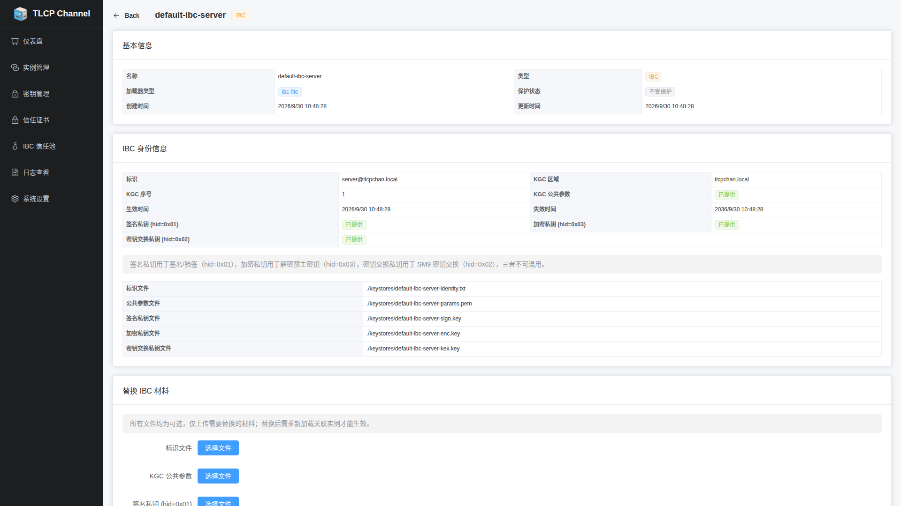

*图11-2：IBC 身份密钥库详情*

- **IBC 身份信息**：标识（如 `server@tlcpchan.local`）、KGC 公共参数状态与有效期、三把用户私钥状态（hid=0x01 签名 / hid=0x03 加密 / hid=0x02 密钥交换）
- **材料文件**：标识文件、公共参数文件、签名/加密/密钥交换私钥文件的路径
- **替换 IBC 材料**：可只上传需要替换的文件（例如仅轮换某把私钥），保存后立即生效

### 3.5 导出证书请求 (CSR)

使用现有密钥生成并导出证书请求文件(CSR)，用于向 CA 机构申请签发证书。

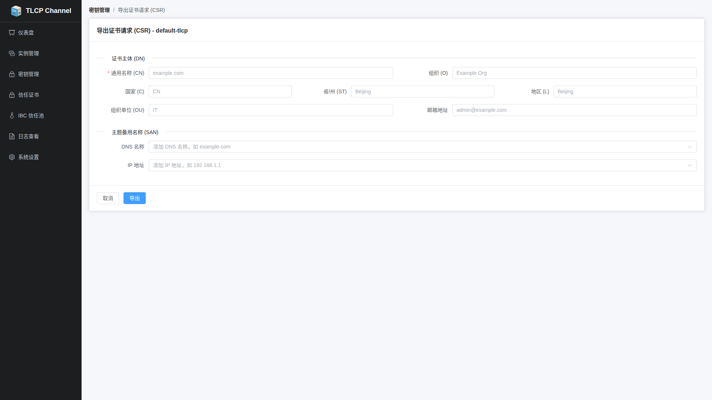

*图10：导出 CSR 文件*

#### 操作步骤

1. 在密钥库列表点击"导出 CSR"按钮，进入导出页面（IBC 身份不支持导出 CSR）
2. 填写证书主题信息（CN、O、OU、C、ST、L、邮箱等）
3. 填写 SAN（DNS 名称、IP 地址）
4. 点击"导出"按钮生成并下载 CSR 文件

### 3.6 删除密钥库

点击密钥库列表中的"删除"按钮，删除密钥库。

**注意：** 删除密钥库会删除对应的证书文件，请确保没有实例正在使用该密钥库。

### 3.7 更新证书和密钥

#### 应用场景

**证书过期更新** - 当现有证书即将过期时，使用此功能更新证书，无需重新创建 keystore。

**密钥轮换** - 定期更换证书私钥以提高安全性。

**外部签发证书** - 使用外部 CA 签发新证书后，上传替换自签名证书。

#### 操作步骤

**步骤 1：打开更新页面**

在密钥库列表中，找到需要更新证书的 keystore，点击"更新证书"按钮。

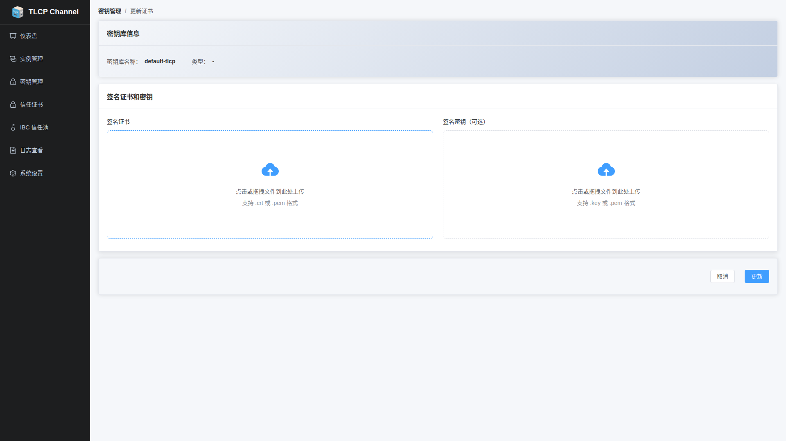

*图18-1：证书上传页面*

**步骤 2：上传证书和密钥**

页面会显示当前 keystore 的信息（名称、类型），并提供文件上传区域。

- 对于 **TLCP** 密钥库：上传签名证书、签名密钥、加密证书、加密密钥
- 对于 **TLS** 密钥库：上传证书和密钥

拖拽文件到上传区域，或点击区域选择文件。

**步骤 3：更新证书**

点击"更新"按钮，系统会：
- 验证证书和密钥格式
- 验证证书和密钥的匹配性
- 原子替换文件
- 自动更新配置
- 重载 keystore

更新成功后会显示提示消息，无需重启服务，新证书立即生效。

#### 注意事项

1. **文件格式**：支持 `.crt`、`.pem`（证书）和 `.key`、`.pem`（密钥）
2. **证书验证**：系统会验证证书格式和证书密钥的匹配性
3. **密钥可选**：可以只上传证书，不传密钥；但不能只传密钥不传证书
4. **原子性更新**：验证失败不会影响现有证书，可安全重试
5. **受保护限制**：受保护的 keystore 不允许更新证书
6. **TLCP 要求**：TLCP 密钥库必须同时提供签名证书和加密证书
7. **实例影响**：证书更新后，正在使用该 keystore 的实例会自动重载证书

### 3.8 更新后重载关联实例

密钥库没有独立的"重载密钥库"操作。在"更新证书/密钥"或替换 IBC 材料成功后，服务端会立即用新装载的密钥库替换内存中的实例；但**已经启动的代理实例仍在使用旧的证书或 IBC 材料**。

密钥库详情页的「关联实例」卡片会列出正在使用该密钥库的实例，可据此逐个进入实例详情页点击"重载"，让运行中的实例用新材料重建配置，无需重启服务。

---

## 3.9 根证书管理


### 3.9.1 根证书列表

根证书列表页面显示所有已添加的根证书。

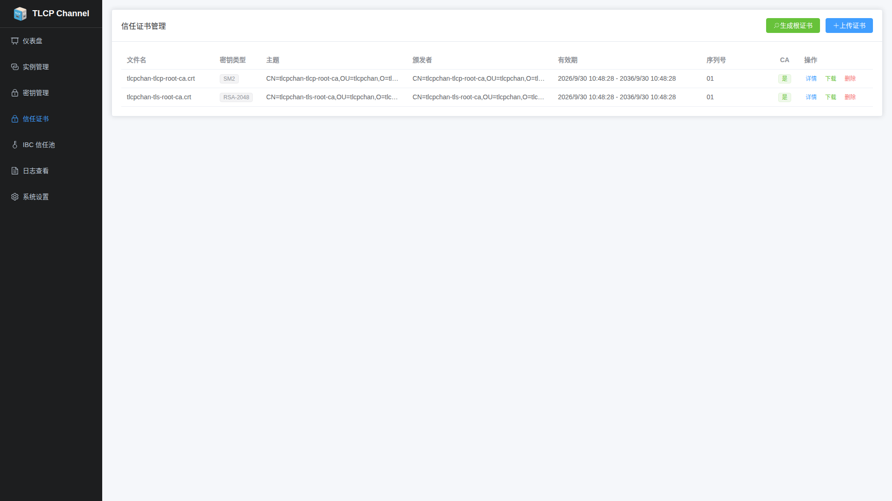

*图12：根证书列表*

列表显示信息：
- 文件名
- 密钥类型（SM2/RSA）
- 证书主题（Subject）
- 证书颁发者（Issuer）
- 有效期（起始时间、过期时间）
- 序列号、是否 CA

### 3.9.2 上传根证书

将外部 CA 的根证书添加到系统信任库中，用于验证客户端或服务端证书。

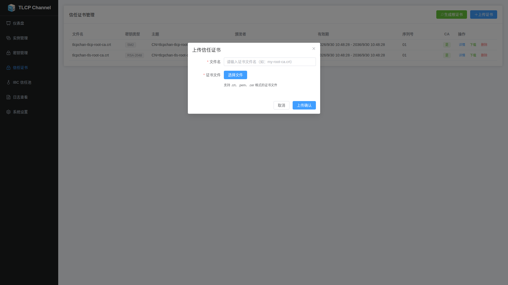

*图13-1：上传根证书*

#### 操作步骤

1. 点击"上传证书"按钮，打开"上传信任证书"对话框
2. 填写保存文件名（如 `external-ca.crt`）
3. 选择要上传的根证书文件（.crt、.pem 或 .der 格式）
4. 点击"确定"上传

系统会将证书保存到 `rootcerts/` 目录，并自动加载到信任库。

### 3.9.3 生成根证书（根 CA）

系统支持生成自签名的根 CA 证书。

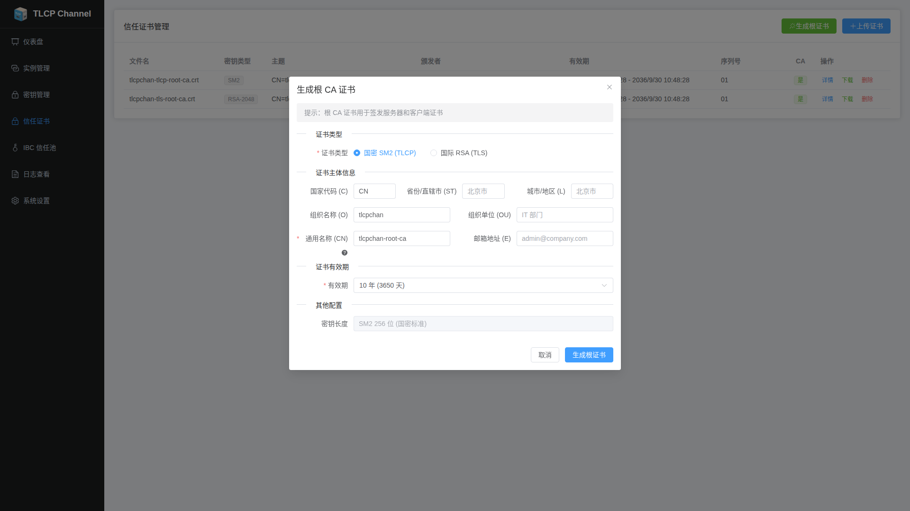

*图13-2：生成根证书（根 CA）*

#### 操作步骤

1. 点击"生成根证书"按钮
2. 选择证书类型（国密 SM2 (TLCP) / 国际 RSA (TLS)）
3. 填写证书主题信息（CN、O、OU、C、ST 等）
4. 填写有效期（默认 10 年）
5. 点击"确定"生成

系统会生成：
- 根 CA 证书（`tlcpchan-root-ca.crt` 或自定义名称）
- 根 CA 私钥
- 自动添加到信任库

### 3.9.4 查看根证书详情

点击根证书列表中的文件名，查看根证书的详细信息。

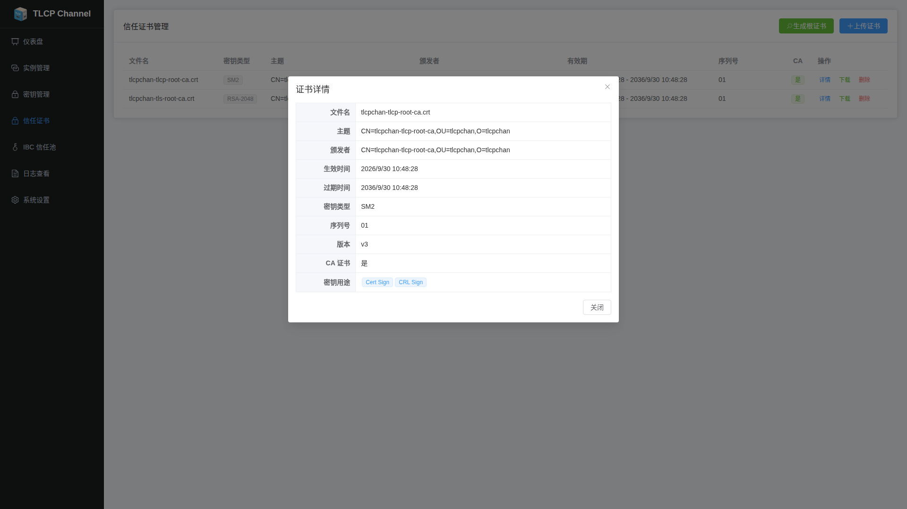

*图14：根证书详情*

详细信息包括：
- 证书主题（Subject）
- 证书颁发者（Issuer）
- 序列号
- 有效期（起始时间、过期时间）
- 公钥信息
- 证书指纹

### 3.9.5 下载根证书

点击根证书的"下载"按钮，下载根证书文件。

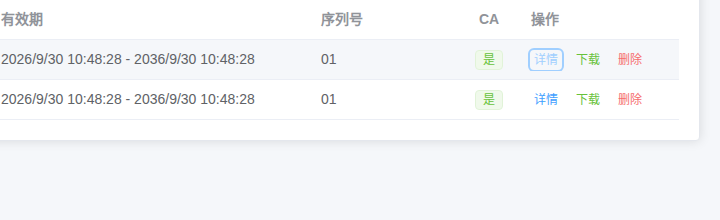

*图15：下载根证书*

### 3.9.6 删除根证书

点击根证书列表中的"删除"按钮，删除根证书。

### 3.9.7 重载根证书

系统会自动重载所有根证书，无需手动操作。在添加或删除根证书后，系统会自动更新信任库。

---

## 3.10 IBC 信任池管理


### 3.10.1 信任池列表

IBC 信任池页面显示所有已导入的 KGC 公共参数。IBC 身份认证中，用户标识即公钥，其真实性由 KGC 公共参数决定，因此只有信任池中存在的 KGC 才能通过握手校验（默认拒绝语义）。

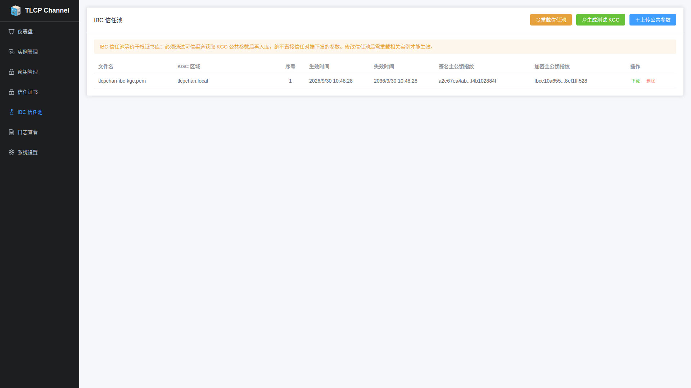

*图20：IBC 信任池列表*

列表显示信息：
- 文件名
- KGC 区域（DistrictName）
- KGC 序号（DistrictSerial）
- 生效时间 / 失效时间
- 签名主公钥指纹（SM3）
- 加密主公钥指纹（SM3）
- 操作：下载、删除

### 3.10.2 生成测试 KGC

用于联调测试：点击"生成测试 KGC"按钮，填写区域名称、序号与有效期（年），系统会生成一对 SM9 主密钥：

- 公共参数保存到 `ibcparams/<区域>-<序号>.pem` 并加入信任池
- 主密钥保存到 `keystores/`（权限 0600，与其它密钥材料同目录，**不会通过任何接口下发**），仅用于派生用户私钥

> ⚠️ 生产环境请使用自建 KGC 的公共参数与用户私钥，不要使用此处的测试 KGC。

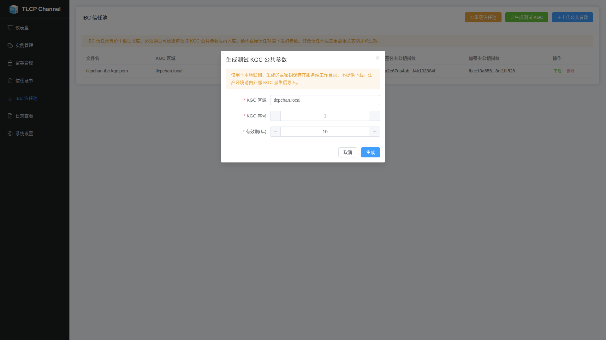

*图21：生成测试 KGC 公共参数*

### 3.10.3 上传公共参数

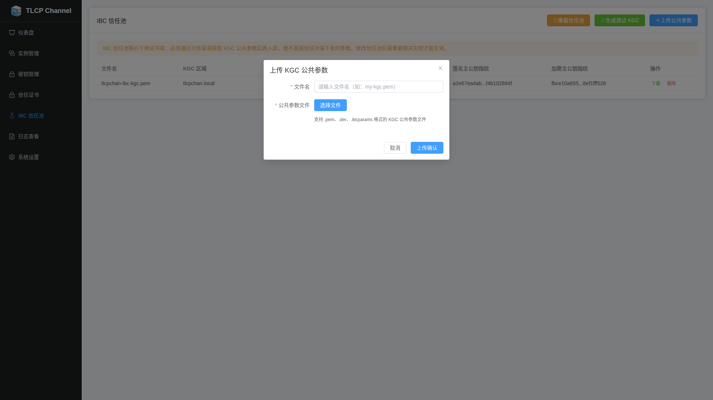

*图22：上传 KGC 公共参数*

1. 点击"上传公共参数"按钮
2. 填写保存文件名（如 `kgc.pem`）
3. 选择 KGC 公共参数文件（支持 PEM / DER / HEX / Base64 文本）
4. 点击"确定"上传

同一 KGC（区域与序号相同）重复上传会被拒绝；扩展名不在 `.pem` / `.der` / `.ibcparams` 白名单时会自动规范化为 `.pem`。

### 3.10.4 下载与删除

- **下载**：在列表中选择条目，点击"下载"可导出 PEM 格式的公共参数，便于分发到其他节点
- **删除**：删除后该 KGC 立即退出信任池，引用它的 IBC 握手将失败

### 3.10.5 重载信任池

修改信任池（新增/删除/替换公共参数）后，点击"重载信任池"按钮重新扫描目录。已运行的实例需要再到实例详情页执行"重载"才会使用新的信任池。

### 3.10.6 与密钥库、实例的联动

- **密钥库**：`ibc` 类型密钥库保存的是"本端标识 + KGC 公共参数 + 三把用户私钥"；生成 IBC 身份时从信任池中选择 KGC，派生出的用户私钥只与标识和该 KGC 有关。IBC 身份不支持导出 CSR。

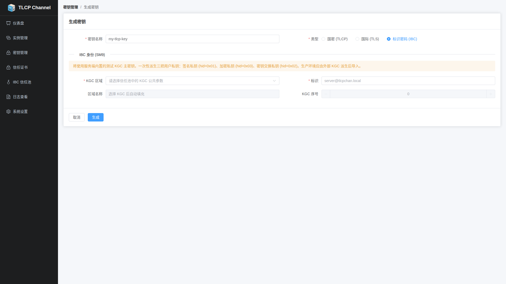

*图23：在密钥管理页生成 IBC 身份（类型选择"标识密码 (IBC)"）*
- **实例**：实例的 TLCP 配置中可同时选择证书密钥库与 IBC 身份密钥库；勾选 IBC/IBSDH 套件后，实例启动时会校验本端 IBC 材料并在缺失时输出明确告警（不会阻止启动）。
- **信任范围**：信任池是全局的（客户端与服务端共用），与根证书库对等。请通过可信渠道获取对端 KGC 公共参数后再导入，切勿直接信任对端在线下发的参数。

---

## 4. 系统管理

### 4.1 系统设置

系统设置页面提供了完整的系统配置管理功能。

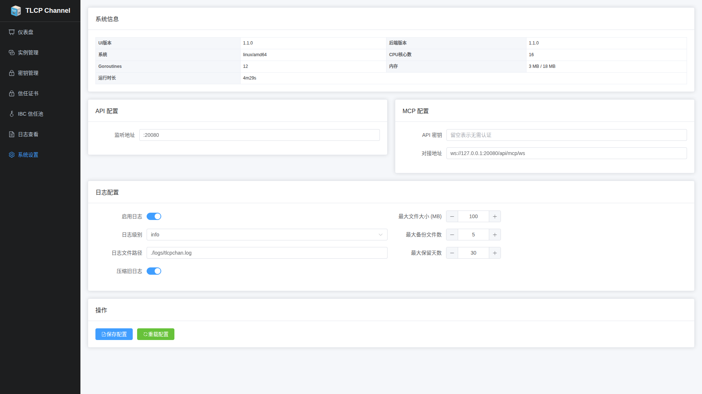

*图16：系统设置页面（含配置查看）*

**系统信息：**
- UI 版本号
- 后端版本号
- 操作系统类型和架构
（显示版本、运行状态）

**API 配置：**
- 监听地址（API 服务端口）
- UI 地址（前端访问地址）

**MCP 配置：**
- API 密钥（留空表示无需认证）
- 对接地址（MCP WebSocket 连接地址）

**日志配置：**
- 启用日志开关
- 日志级别（debug/info/warn/error）
- 日志文件路径
- 最大文件大小（MB）
- 最大备份文件数
- 最大保留天数
- 压缩旧日志开关

**操作：**
- **保存配置** - 保存当前配置到文件
- **重载配置** - 重载配置文件，使更改生效

**说明：** 系统不支持通过 UI 直接修改配置文件。配置更新需要：
1. 编辑服务器上的 `config.yaml` 配置文件
2. 点击"重载配置"按钮或使用 `tlcpchan-cli config reload` 命令重载配置
3. 验证配置已生效（查看系统信息）

### 4.2 日志查看

日志查看器提供系统和实例日志的查看功能。

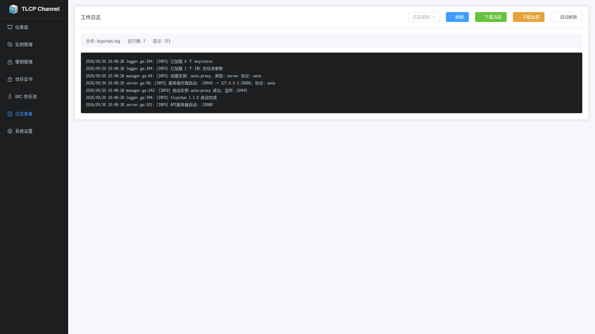

*图17：日志查看器*

**功能说明：**
- **日志文件** - 显示当前日志文件（`tlcpchan.log`）及其总行数与当前显示行数
- **日志级别筛选** - 选择要显示的日志级别（debug/info/warn/error）
- **刷新** - 手动刷新日志内容
- **自动刷新** - 开启后定时拉取最新日志
- **下载当前** - 下载当前显示的日志文件
- **下载全部** - 打包下载所有日志文件

**日志显示：**
- 每条日志显示时间戳、日志级别和消息内容
- 不同级别使用不同颜色标识
- 支持滚动查看历史日志

